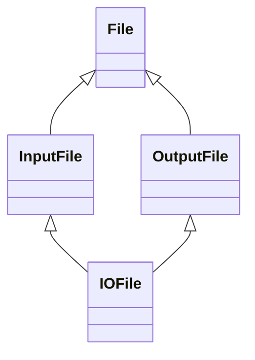

# 闲隙碎笔

## *Effective C++*


### 技巧

#### 命名习惯

~~~c++
// lhs(left-hand side), rhs(right-hand side)
// 常常使用在binary operators(二元操作符), eg. opertor== or operator*
const Rational operator*(const Rational& lhs, const Rational& rhs);
a * b;

// 对于指针类型的命名方式
Widget* pw;
// 对于引用类型的命名方式
Widget& rw;
~~~


### Item2: 尽量以const, enum, inline代替#define

~~~c++
/*
	可能在编译器处理ASPECT_RATIO之前，就被预处理器拿走了，ASPECT_RATIO可能没有进入符号表。
*/
#define ASPECT_RATIO = 1.653
const float AspectRatio = 1.653;

/*
	当仅在编译的时候需要一个class常量，可以使用"enum-hack补偿做法"
*/
private:
    enum { ASPECT_RATIO = 5, ASPECT_RADIO = 6 }; // 类似于#define
    int arr[ASPECT_RATIO];

/*
	宏函数
*/
#define CALL_WITH_MAX(a, b) f((a) > (b) ? (a) : (b)) // ab取大值调用f函数，这样的宏函数非常糟糕，所有实参都需要小括号

//可以使用class template
template<typename T>
inline CallWithMax(const T& a, const T& b) // 这个template产出一整群函数，接受两个同型对象
{
    f(a > b ? a : b);
}

/*
	Summary
*/
1. 有了enum, inline, const, 对预编译器(特别是#define)的需求降低了，但是对于#include, #ifdef, #ifndef, #endif仍然在控制编译中有巨大作用。
2. 对于单纯常量, 使用const和enums代替#define
3. 类似函数的宏(macros), 最好改用inline代替#define
~~~


### Item3: 尽可能使用const

```c++
/*
	区分const, 看const出现在*的左侧还是右侧, 出现在*的左侧表示修饰被指物, 表示被指物不能被修改
	出现在*的右侧, 表示修饰指针本身, 表示不能地址不能修改, 也就是不能指向其他(指针本身就是地址)
*/
void f1(const Widget* widget);
void f2(Widget const * widget);// 二者表示的意思都一样, 常量指针, 修饰被指物

除非需要改变参数或者local对象, 否则就使用const修饰

/*
	const成员函数
*/
改善C++效率的根本办法是, 以pass by reference-to-const的方式传递对象, 而此技术的前提是可以使用我们有const函数处理修饰const对象.
有一点被漠视了, 如果两个函数只有常量性不同的话, 是可以被重载的.
Widget& operator[](std::size_t position) { return text_[position]; }
const Widget& operator[](std::size_t position) const { return text_[position]; }

//使用场景
const Widget widget("hello"); // 常量对象
std::cout << widget[0] << std::endl;

//const成员函数不能修改成员变量, 但是变量通过mutable修饰就可以修改
mutable int num = 10;
void ChangeNum(int newNum) const
{
    num = newNum;
}

// non-const和const版本的两个函数, 写出两个重复逻辑的函数, 可以使non-const调用const版本的
const Widget& operator[](std::size_t position) const { return text_[position]; }
Widget& operator[](std::size_t position) {
    return const_cast<Widget&>(static_cast<const Widget&>(*this)[position]); //为*this修饰const Widget, 从而调用const operatotp[], 而使用const_cast转除了const op[]返回的const类型
}

/*
	summary
*/
1. 使用const可以帮助编译器侦测出错误用法, const可是施加在任何作用的任何对象, 函数返回类型, 函数参数类型, 函数本体
2. const函数和non-const有着等价实现的时候, 可使用non-const调用const版本, 可以避免重复代码
3. const对象只能调用const成员函数
```


### Item4: 确定对象被使用前已先被初始化

```c++
/*
	总是使用成员初值列
*/
ABEntry::ABEntry() : name_(), address_(), phone_() {}

/*
	summary
*/
1. 对于内置数据类型要手动初始化
2. 构造函数最好成员初值列, 而不是在函数内进行赋值操作. 其初值列顺序应该和class声明顺序
3. 为免除跨编译单元之初始化次序，以local-static代替non-local-static
class Timer {};
Timer timer; // non-local-static

class Logger {};
Logger logger; // non-local-static

如果timer要在logger之前初始化, 但是实际可能相反

Timer& GetTimer()
{
	static Timer timer;
	return timer;
}
...
因为local-static在第一次被调用的时候初始化, 因此顺序是固定的
且c++11保证了线程安全的问题
```


### Item5: 了解c++默默编写并调用了哪些函数

```c++
/*
	当写一个空类的时候，编译器会默默声明default ctor, copy ctor, copy assignment, dtor
*/
class Empty
{
    Empty();
    Empty(const Empty& lhs);
	~Empty();

	Empty& operator=(const Empty& lhs);
};
```


### Item6: 若不想使用编译器自动生成的函数, 则应该明确拒绝

```/**/
当不想支持copy ctor, copy assignment时, 应该明确拒绝
对于这两个函数, 放在private中并且不予实现
```


### Item7: 为多态基类声明virtual dtor

```c++
/*
	如果基本的dtor不是virtual就会导致, 调用的是基类的析构, 而不去调用派生的析构. 则导致局部析构
*/
1. 含多态的base classes的dtor应该声明为virtual, 如果class中存在virtual函数, 则把他的dtor定义为virtual的.
```


### Item8: 别让异常逃离析构函数

```c++
DBConn::~DBConn() {
    try () { db.close(); }
    catch () { std::abort(); } // 若在dtor出现异常, 则强迫结束程序
}
```


### Item9: 绝不再ctor或dtor中调用virtual函数

```c++
/*
	1. base class, derived class
	2. 在多态中, 是先调用的base的ctor再去调用derived的ctor. dtor则相反, 先去调用derived再去调用base的.
	如果在base的ctor中调用的derived的virtual, 此时的derived可能还没有初始化.
*/

TIPS: 
// 这样虽然在构造中显示调用virtual函数, 但是init中调用了纯虚函数, 
class Base
{
private:
    void init()
    {
        virtualMethod();
    }
public:
    Base() { init(); }
    ~Base() {}

    virtual void virtualMethod() = 0;
};

// 把base的virtual改成non-virtual函数, 而在derived中调用base的构造
class Base
{
private:
    void init()
    {
        initMethod();
    }
public:
    Base() { init(); }
    ~Base() {}

    void initMethod() {}
};

class Derived : public Base
{
private:
public:
    Derived() : Base() {}
    ~Derived() {}
};

/*
	summary
*/
1. 在derived class中必要的构造信息向上传递至base class的构造函数中. 
2. 在ctor, dtor中不调用virtual函数, 因为在本类的ctor, dtor不会下降至derived clas中.
```


### Item10: 另operator=返回reference to *this

~~~c++
Widget& operator=(const Widget& rhs)
{
    // ...
    return *this;
}
// 这种协议不仅适用于标准赋值形式, 也适用于赋值相关运算
Widget& operator+=(const Widget& rhs) // +=, -=, *=等
{
    // ...
    return *this;
}
~~~


### Item11: 在operator=中处理自我赋值

~~~c++
a[i] = a[j]; // 潜在的自我赋值

*px = *py; //如果px和py都指向同一个地址,

class BitMap {};
class Widget {
public:
	Widget() {}
	Widget& operator=(const Widget& rhs);
private:
	BitMap* pb;
};
Widget& Widget::operatot=(const Widget& rhs)
{
    delete pb;
	pb = new BitMap(*rhs.pb);
    return *this;
}
// 如果此时的rhs.pb和this.pb指向的都是同一个. 删除了this.pb, 那rhs.pb也被删除了, 这明显是一个错误.
// 想要阻止这种, 添加一个认同测试
Widget& Widget::operatot=(const Widget& rhs)
{
    if (this != &rhs) {
        delete pb;
		pb = new BitMap(*rhs.pb);
    }
    return *this;
}

// copy and swap
class Widget {
    void swap(Widget& rhs); // 交换*this和rhs的数据
}
Widget& Widget::operator=(const Widget& rhs)
{
    Widget temp(rhs);
    swap(temp);
	return *this;
}

Widget& Widget::operator=(Widget rhs)
{
    swap(temp);
	return *this;
}

/*
	summary
*/
确保当对象自我赋值时 operator= 有良好的行为. 其中技术包括比较"来源对象" 和 "目标对象" 的地址.
~~~


### Item12: 复制对象时勿忘其每一个成分

```c++
// 在继承下, 在derived类中其base类的成员属性也要初始化
class Customer {
public:
private:
	std::string name_;
    Date lastTransaction;
};
class PriorityCustomer : public Customer {
public:
    PriorityCustomer(const PriorityCustomer& rhs);
    PriorityCustomer& operator=(const PriorityCustomer& rhs);
private:
    int priority_;
};
PriorityCustomer::PriorityCustomer(const PriorityCustomer& rhs) : Customer(rhs), priority_(rhs.priority_) {}
PriorityCustomer& PriorityCustomer::operator=(const PriorityCustomer& rhs)
{
    Customer::operator=(rhs);
    priority_ = rhs.priority_;
    return *this;
}
/*
	summary
*/
1. 确保复制local成员变量, 调用所有base classes内的适当的copying函数
2. 对于copy ctor和copy assignment, 有相近的代码, 消除重复代码的做法是, 建立一个新的成员函数给两者调用. 通常为init().
```


### Item13: 以对象管理资源

```tex
1. 把资源放进对象内, 便可以依赖C++的dtor自动调用机制"确保资源被释放".
2. 许多资源被分配在heap中, 之后被用于单一区块或函数内, 他们应该在控制流离开那个区块或者函数时被释放.
3. 对于auto_ptr或shared_ptr在dtor中调用的是delete而不是delete [], 所以给动态分配的array[]使用智能指针是糟糕的.
```


### Item14: 在资源管理类中小心使用coping行为

```c++

```


### Item15: 在资源管理类中提供对原始资源的访问

~~~tex
1. APIs往往要求访问原始资源, 所以每一个RAII class应该提供一个"取得其所管理之资源"的办法
2. 对原始资源的访问可能经由显式转换或隐式转换, 一般而言显式比较安全, 但隐式对客户比较方便
~~~


### Item16: 成对使用new和delete时采用相同形式

~~~tex
如果new的表达式使用[], 也在相应的delete使用[]
~~~


### Item17: 已独立语句将newed对象置入智能指针

~~~c++
void procesPriority(std::shared_ptr<Widget>(new Widget), priority());
// 这实际存在内存泄漏的问题, 这一条语句可分为 1. new Widget 2. 调用priority 3. std::shared_ptr构造函数
但如果new Widget指针调用调用priority, 异常情况下, 返回的指针会将会遗失

// tips
已独立的语句将newed对象存储于智能指针中, 如果不这样, 一旦异常被抛出, 有可能导致难以察觉的资源泄漏.
~~~


### Item18: 让接口容易被正确使用, 不易被误用

```c++
class Date {
public:
    Date(const Month& month, const Day& day, const Year& year);
};
struct Day {
explicit Day(int day) : val(day) { }
int val;
};
struct Month {
explicit Month(int month) : val(month) { }
int val;
};
struct Year {
explicit Year(int year) : val(year) { }
int val;
};
/*----------------------------------------------------------*/
Date date(33, 30, 2025); // 错误, 禁止隐式转换
Date date(Day(30), Month(3), Year(2025)); // 错误, 参数类型写错
Date date(Month(3), Day(30), Year(2025)); // OK, 类型正确


// 类似一个Factory函数, 创建了CreateInvestMent(), 可能返回的是InvestMent*, 会造成内存泄漏, 可以修改为
std::shared_ptr<InvestMent> CreateInvestMent();
// 而实际shared_ptr接受两个参数, 一个是被管理的指针, 一个是删除器(当引用次数为0被调用的删除器)
std::shared_ptr<InvestMent> pInv(static_cast<InvestMent*>(0), GetRidOfInvestMent); // 实参1 必须为严格的指针, 所以必须转型为指针
auto pInv = std::make_shared<InvestMent>(new InvestMent(), GetRidOfInvestMent);
```


### Item19: 设计class犹如设计type

~~~c++
// question
// 1. 新type的对象应该如何被创建和销毁?
这涉及到ctor和dtor, operator new | operator new[] | operator delete | operator delete[]
// 2. 对象的初始化和对象的赋值该有什么差别?
初始化是在构造函数中而赋值是通过assignment操作符, 之间的差异是对于不同函数的调用.
// 3. 新type的对象如果被passed by value, 意味着什么?
copy构造函数定义一个type的pass-by-value该如何实现.
// 4. 什么是新type的"合法值"?
对于class成员变量而言, 通常只有某些数值是有效的, 而这些数据集决定了class维护的约束条件, 这也就决定了ctor或者assignment操作符和setter函数必须进行错误检查工作.
// 5. 新的type需要配合某个继承图系吗?
继承的哪些classes就要受那些classes约束, 尤其是他们的virtual函数. 如果允许其他classes继承你, 那会影响你所声明的函数, 尤其是dtor是否为virtual.
// 6. 新的type需要什么样的转换?
如果你希望T1和T2之间互相转换, 就需要在T1类中写一个转换T2的函数, 或者在T2写一个non-explicit-one-argument(可被单一实参调用)的ctor, 若只允许explicit的构造函数存在, 就得写出专门负责执行转换的函数.
// 7. 什么样的操作符和函数对此新的type是否合理?

// 8. 谁该取用新type的成员?
这个问题可以帮助决定哪个成员为public, 哪个为protected, 哪个为private. 也可以帮哪些classes或function为friends.
// 9. 什么是新type的"未声明接口"?

// 10. 新type有多么一般化?
或者定义的不应该是一个type而应该是一整个types, 不该定义一个新class, 而是定义一个新的class template.
// 11. 是否真的需要一个新的type?
~~~


### Item20: 宁以pass by reference to const 替换 pass by value

```c++
// pass by value 值转递, 返回一个复件. 是通过copy构造函数产出, 这可能使其成为费时的操作.

bool VaildateStudent(Student s);
Student plato;
bool platoIsOK = VaildateStudent(plato);
/*--------------------------------------------------*/
1. VaildateStudent函数调用, 以plato为蓝本的Student s的拷贝函数会调用, 而离开函数Student的dtor会被调用.
2. 如果情况变得更加复杂(例如存在继承关系(父类也要被构造), 有很多成员变量等), 后有更多的ctor和dtor会被调用.
/*--------------------------------------------------*/
而正确的行为是通过 pass by reference to const, 这其中没有任何ctor或者dtor被调用. 而加入const修饰, 是忧虑调用者会不会修改传入的对象.
/*--------------------------------------------------*/
以引用传递也可以避免slicing(对象切割)的问题, 当一个derived class对象以值转递的方式并视为一个base class对象, base的构造函数会被调用, 造成了次对象行为像个derived class对象的那些特质全被切割掉了, 只留下base class对象.
class Window {}; // virtual function: Display()
class WindowWithScrollBar : public Window {};
void print(Window w) { w.Display(); }

WindowWithScrollBar wwsb;
print(wwsb); // 因为是值转递, 调用的是base的ctor, 因此内部调用的还是Window的Display
void print(const Window& w) { w.Display(); } // 而通过引用转递, 传递进来的是什么类型, w就是什么类型.
/*--------------------------------------------------*/
一般而言, 值转递并不昂贵的唯一对象是: 内置数据类型、STL迭代器、函数对象. 其他东西, 尽量以pass-by-reference-to-const替换pass-by-value.
```


### Item21: 必须返回对象时, 别妄想返回其的reference

```c++
// 错误示例
const Rational& operator*(const Rational& lhs, const Rational& rhs) {
    Rational result(lhs.num_ * rhs.num_); // 返回一个局部变量的引用, 这是错误的. 局部变量, 定义在stack中.
    Rational *result = new Rational(lhs.num_ * rhs.num_); // 定义在heap中. 问题是在于new之后, 谁对他delete呢?
	static Rational result; // if ((a * b) == (c * d)), 调用operator*后返回都同一个static, 所以operator==一定是相等的
    return result;
}
/*--------------------------------------------------*/
// 若必须返回一个对象, 
const Rational operator*(const Rational& lhs, const Rational& rhs) {
    return Rational(lhs.num_ * rhs.num_);
}
/*--------------------------------------------------*/
1. 绝不要返回point或者reference指向一个local stack对象
2. 或返回的reference指向一个heap-allocated对象
3. 或返回的point或reference指向一个local-static对象而有可能同时需要多个这样的对象.
4. Item4已经为"在单线程环境中合理返回reference指向一个local-static对象"
```


### Item22: 将成员变量声明为private

```c++
1. 当一个变量是public, 客户可能在使用他们, 而现在要删除或者是修改为private, 这其中的影响会有多大呢?
2. 同理, 当一个protected变量删除, 那么所有的derived classes都会受到影响.
/*--------------------------------------------------*/
1. 所以将成员变量声明为private, 这可以赋予客户访问数据的一致性. 而protected不比public更具封装性.
```


### Item23: 宁以non-member, non-friend替换member函数

~~~c++
1. namespace与class不同, namespace可以跨越很多源文件.
2. 在namespace中, 创建不同的.h文件, 声明过同namespace的non-member函数后, 就可以直接使用它. class定义式对于客户而言是不可扩展的.
~~~


### Item24: 若所有参数皆需要类型转换, 请为此采用non-member函数

~~~c++
Rational result;
Rational oneHalf;
result = oneHalf.operator*(2); // 正确, Rational重载了operator*方法
result = 2.operator*(oneHalf); // 错误, 而2这个class没有operator*方法
/*--------------------------------------------------*/
// 如果ctor未被定义为non-explicit, 编译器则会根据2创建一个临时Rational对象,
const Rational temp(2);
result = oneHalf * temp;
/*--------------------------------------------------*/
// 而如果ctor为explicit, 无法将2隐式转换为一个Rational
result = oneHalf * 2; // 可以编译过？？？？？？
result = 2 * onHalf;

class Rational {
    explicit Rational(int num);
    const Rational operator*(const Rational& rfs) const;
};
// 因为构造是explicit
Rational r = 5; // 错误, 不能隐式转换
Rational r(5);
// 为什么oneHalf * 2会编译过
auto result = oneHalf * 2; // 是operator*的函数调用, 相当于oneHalf.operator*(2), 尽管构造是explicit但是再参数列中是允许允许将2显示构造为Rational(2)
// 而2 * oneHalf为什么会编译失败
auto result = 2 * oneHalf;
// 因为2 * oneHalf是一个全局运算符operator*()的调用, 相当于operator*(2, oneHalf), 由于2是调用者而不是参数列, 所以不允许显示构造为Rational(2)
/*--------------------------------------------------*/
// 怎么解决呢, 定义一个non-member, 在参数列中的参数可以允许实参被隐式类型转换
const Rational operator*(const Rational& lhs, const Rational& rhs);
auto result = 2 * oneHalf; // 此时就会编译过了, 在参数列可以被隐式转换
/*--------------------------------------------------*/
如果需要为某个函数的所有参数(包括被this指针所指的那个隐喻参数)进行类型转换, 那么这个函数必须是non-member
~~~


### Item25: 考虑写出一个不抛异常的swap函数

```c++
template<typename T>
void DoSomething(T& obj1, T& obj2) 
{
    using std::swap;	// 防止在对应命名空间找不到swap, 可以调用std::swap函数
    swap(obj1, obj2);	// 此时会调用谁的swap呢, 是T的特别swap, 还是std::swap呢？
}
他会找到T所在的命名空间内的任何T专属的swap, 如果T是Widget并位于命名空间WidgetStuff内, 找到WidgetStuff对应的swap. 如果没有则会调用std::swap
/*--------------------------------------------------*/
1. 当std::swap对你的类型效率不高时, 提供一个成员版本的swap成员函数, 并确定这个函数不抛出异常.
2. 如果你提供一个member swap, 也该提供一个non-member swap, 对于classes(而非templates), 也请特化std::swap.
3. 调用swap时应对std::swap使用using声明式, 然后调用swap不带任何"命名空间修饰的"
4. 
```


### Item26: 尽可能延后变量定义式的出现时间

```c++
// 当密码太短的时候, 会抛出一个异常, 而定义的encrypted没有使用, 但是仍要付出其的dtor成本.
std::string EncryptPassWord(const std::string& password)
{
    using namespace std;
    // string encrypted;
    if (password.length() < MINIMUMPASSWORDLENGTH) {
        throw logic_error("password is too short");
    }
    string encrypted(password);
    encrypt(encrypted); // 加密算法
    return encrypted;
}
// 尽可能延后变量的定义式的出现, 直到真正用的时候再去定义.
```


### Item27: 尽量少做转型动作

~~~c++
// c++提供四种转型
const_cast<T>();		// 将对象常量性转除
static_cast<T>();		// 用于强迫隐式转换, 将non-const转为const的, int转double等.
dynamic_cast<T>();		// 安全向下转型
reinterpret_cast<T>();	// 执行低级转型, 例如将pointer to int转型为一个int.
/*--------------------------------------------------*/
任何一个类型转型, 无论是通过转型操作而进行的显示转换, 还是通过编译器完成的隐式转换, 往往真的令编译器编译出运行期执行的码.
/*--------------------------------------------------*/
1. 如果可以, 尽量避免转型, 特别是在注重效率的代码中避免使用dynamic_cast
2. 如果转型是必要的, 试着将它隐藏在函数背后, 客户随着调用该函数, 而不需将转型放进他们的代码中.
3. 宁愿用c++的转型, 而不用旧式转型, 前者很容易辨认出来, 而且也分门别类的功能.
~~~


### Item28: 避免返回handles指向对象内部成分

~~~c++
class Point {
public:
	Point(int x, int y);
	void SetX(int x);
    void SetY(int y);
};
struct RectData {
    Point ulhc; // upper left-hand corner
    Point lrhc; // lower right-hand corner
};
class RectTangle {
public:
	Point& UpperLeft() const { return pDate->ulhc; } // 矛盾的点在于函数为const, 而函数内部返回了private变量的引用. 可以被修改.
	const Point& LowerRight() const { return pDate->lrhc; } // 但是这样还是返回private的handle, 即使他是const不可修改的.
private:
    std::shared_ptr<RectData> pData;
};
/*--------------------------------------------------*/
1. 避免返回handle(包括reference, point, iterator)指向对象内部. 遵守这条可以增加封装性, 帮助const成员函数的行为像个const, 并将发生“虚吊号码牌”(dangling handles 悬空引用)的可能性降到最低. 
~~~


### Item29: 为"异常安全"而努力是值得的

~~~c++
void ChangeBackGround(std::istream& imgSrc)
{
    using std::swap;
    Lock(&mutex);
    std::shared_ptr<PImpl> pNew(new PMImpl(*pImpl));
    pNew->bgImage.reset(new Image(imgSrc)); // 修改副本
    ++pNew->imageChanges;
    swap(pImpl, pNew); // copy and swap 技术, 创建副本, 即使在new中出现错误, 也不会影响pImpl
}
// copy and swap策略是对对象状态作出"全有或者全无"改变。
~~~


### Item30: 透彻了解inlining的里里外外

~~~c++
1. 调用Inline函数, 不需受函数调用所招致的额外开销, 而Inlining在大多数C++程序中是编译期行为.
2. 而Templates通常也被置于头文件内, 因为它一旦被使用, 编译器为了具象他, 需要知道他张什么样子.
3. 而编译器对过于复杂的函数(递归或循环)拒绝inlining, 而对于virtual函数也拒绝, 因为virtual是要在运行期才确定调用哪个函数.
/*--------------------------------------------------*/
1. 将大多数inlining限制在小型, 被频繁调用的函数身上, 这可使日后的调试过程和二进制升级更容易, 也可使潜在的代码膨胀问题最小化, 使程序的速度提升机会最大化.
2. 不要因为function template出现在头文件中, 就将他们声明为inline.
~~~


### Item31: 将文件间的编译依存关系降至最低

~~~c++
Q: 当只修改private的实现部分, 然后构建整个程序, 可能会发现都需要重新编译和连接, 是因为"没有将接口从实现中分离这件事"做的很好,
/*--------------------------------------------------*/
class Person { // 此时的Person编译不过, 因为没有取到classes string等的定义式. 而这样的定义式通常有#include
	Person();  
    std::string name() const;
private:
    std::string name_;
};
例如, #include<Person.h>, 而当Person发生修改, 所有所有使用Person class的文件也需要重新编译
/*--------------------------------------------------*/
1. 对于标准库里面的类, 不能使用前向声明
#include <string>
#include <memory>

class PersionImpl;
class Date;
class Address;
class Person {
public:
    Person(const std::string& name, const Date& date, const Address& addr);
private:
    std::shared_ptr<PersonImpl> pImpl;
};
这样就使得Person客户和Date, Address和Person的实现分离了, 这样classes的任何修改都不要Person客户端重新编译.
/*--------------------------------------------------*/
1. 如果可以使用object&或者object pointer, 就不要似乎用object.因为使用object需要他的定义式, 也就是要引其头文件.
2. 尽量以class声明式替代class定义式. 也就是使用前向声明代替#include头文件
/*--------------------------------------------------*/
对于Handle classes, 成员函数必须通过implementation pointer取得对象数据, 那会为每一次访问增加一层间接性, 而每一个对象消耗的内存数量必须增加implementacion pointer的大小, 最后impl必须初始化.
class Person {
public:
    Person(const std::string& name, const Date& date, const Address& addr);
private:
    std::shared_ptr<PersonImpl> pImpl;
};
/*--------------------------------------------------*/
对于Interface classes, 由于每一个函数都virtual, 所以必须为每一次函数调用付出一个间接跳跃处呢根本. 而Interface class派生的对象内必须包含一个vptr, 这个指针可能会增加所需的内存.
class RealPerson : public Person {
public:
	RealPerson();
private:
	return std::shared_ptr<RealPerson> (new RealPerson());
};
/*--------------------------------------------------*/
inline函数是要再编译期间就要确定的, 无论Handle classes或Interface classes, 一旦脱离inline函数无法有太大作为.
在程序发展过程中使用Handle classes和Interface classes以求实现玛有所变化是对客户端带来最小的冲击, 而它们导致速度或大小差异过于重大以至于classes之间的耦合相形只下不成为关键时, 就以具象类替换Handle classes和Interface classes.
/*--------------------------------------------------*/
1. 编译依存性最小化的一般构想是: 相依于声明式(前向声明), 不要相依定义式(#include). 基于此构想的两个手段是Handle classes和Interface classes.
2. 程序库头文件应该以"完全且仅有声明式的形式存在", 这种做法不论是否涉及templates都适用.
~~~


### Item32: 确定你的public继承塑模出is-a关系

~~~c++
1. 如果令class D(Derived)以public形式继承class B(Base), 你便是告诉C++编译器说, 每一个类型D的对象同样是一个类型B的对象, 反之不成立.
class Person { ... };
class Student : public Person { ... };
每个学生都是人, 但并非每个人都是学生. 对每一个人都成立的事, 对每一个学生也成立. 而对学生可成立的每一件事, 未必对人也成立.
/*--------------------------------------------------*/
public 继承意味着is-a. 适用于base classes身上的每一件事情也一定适用于derived classes身上, 因为i每一个derived对象也是base对象.
~~~


### Item33: 避免遮掩继承而来的名称

~~~c++
int x;
void someFunc()
{
    double x;
	std::cin >> x; // 内层的x会遮掩外层的x
}
/*--------------------------------------------------*/
而在继承关系中, base和derived关系就如同derived嵌套在base的作用域中, 而derived会遮掩base的.
void Derived::mf4()
{
    mf2(); // 先会在Derived作用域中寻找mf2函数, 如果没有会去base作用域寻找, 最后则会到global寻找.
}
/*--------------------------------------------------*/
如果你不想base的被遮蔽, 要引入using声明式, 
class Dervied : public Base {
public:
    using Base::mf1;
    using Base::mf2;
    ...
};
void Derived::mf4() {
    mf1();	// 这样声明过了, 就可以调用到被遮蔽的base的函数
    mf1(x);
}
/*--------------------------------------------------*/
在private继承下, using声明式派不上场, 因为private继承后, base的virtual函数不能通过derived对象去调用(外部不能调用), 且private继承下无法多态, 也就是父类指针子类对象.
class Base {
public:
    void mf1(int);
};
class Derived : private Base {
public:
    void Callmf1() // 转交函数
    {
        Base::mf1();
    }
};
/*--------------------------------------------------*/
1. derived classes内的名称会遮蔽base classes内的名称, 
2. 为了让被遮蔽的名称可以被使用, 可使用using声明式或转交函数
~~~


### Item34: 区分接口继承和实现继承

~~~c++
1. 声明一个pure virtual函数的目的就是为了让derived classes只继承函数接口, 
2. 声明impure virtual函数的目的, 是为了derived classes继承该函数的接口和默认实现.
3. non-virtual函数具体指定接口继承, 以及强制性实现继承. 说人话就是因为是non-virtual函数, derived只能去调用base的该函数, 而不能override.
~~~


### Item35: 考虑virtual函数以外的其他选择

~~~c++
class GameCharacter {
public:
    virtual int HealthValue() const; // 因为impure vitual函数, 暗示会有一个默认的计算健康指数的算法.
};
也可以有别的替代方案, 
/*--------------------------------------------------*/
// 由non-virtual interface 手法实现 Template Method设计模式, 也称为 non-virtual interface(NVI)手法
class Base {
public:
    int HealthValue()
    {
        int retVal = DoHealthValue();
        return retVal;
    }
    
    virtual int DoHealthValue() const { ... } // 含一个默认算法, Derived也可以重写他
};
1. 直接在class定义式内呈现成员函数本体, 也就将他们暗自转成inline. (在class内部实现的接口, 就默认为inline的)
2. 也称HealthValue为virtual DoHealthValue函数的wrapper
/*--------------------------------------------------*/
// 由Function Pointers实现Strategy设计模式
int defaultHealthCalc(const GameChararcter& gc);
class GameCharacter {
public:
    typedef int (*HealthCalFunc)(const GameCharacter&);
    explicit GameCharacter(HealthCalFunc hfc = defaultHealthCalc) : healthCalFunc_(hfc) {}
	int HealthValue() const { healthCalFunc_(*this); }
private:
    HealthCalFunc healthCalFunc_;
};
// 这样相比virtual提供了更多弹性
class EvilBadGuy : public GameCharacter {
public:
    explicit EvilBadGuy(HealthCalFunc hfc = defaultHealthCalc) : healthCalFunc_(hfc) {}
};
int loseHealthQuickly(const GameCharacter&); // 两种不同计算健康指数算法
int loseHealthSlowly(const GameCharacter&);

EvilBadGuy guy1(loseHealthQuickly); // 相同类型使用不同算法
EvilBadGuy guy2(loseHealthSlowly);
/*--------------------------------------------------*/
// 由std::function完成strategy设计模式
typedef int (*HealthCalFunc)(const GameCharacter&); // 为函数指针, 只能接受函数和无捕获的lambda, 涉限很多, 好处就是调用无开销
typedef std::function<int(const GameCharacter&)> HealthCalFunc; // function, 容错更高一些, 但是有一定的调用开销, 但是一般都是使用using而非typedef
using HealthCalFunc = std::function<int(const GameCharacter&)>;

class GameCharater;
class HealthCalcFunc {
public:
    virtual int calc(const GameCharater& gc) const;
};

HealthCalcFunc defaultHealthCalc;
class GameCharater {
public:
    explicit GameCharater(HealthCalcFunc *hcf = &defaultHealthCalc) : healthcalcFunc_(hcf) {}
    int HealthValue() const { healthcalcFunc_->calc(*this); }
private:
    HealthCalcFunc *healthcalcFunc_;
};
// 相当于是把健康的计算算法使用策略模式, 只要对HealthCalcFunc添加Derived classes就可以实现不同的算法.
/*--------------------------------------------------*/
1. NVI, Template Method, 是通过基类的某个方法A, A调用virtual利用多态去实现不同的计算算法.
2. Strategy Method, 计算算法通过接受不同的函数指针或者是function入参, 达到调用不同算法的目的, 接受的成员一般为base的成员. 将virtual函数替换为"函数指针成员变量", 这是Strategy设计模式的某种形式.
3. 将virtual函数替换为"std::function", 这是Strategy设计模式的某种形式.
4. 将继承体系内的virtual函数替换为另一个继承体系的virtual函数, 这是strategy设计模式的传统实现手法.
~~~


### Item36: 绝不重新定义继承而来的non-virtual函数

~~~c++
// 因为derived class会遮蔽base class的同名non-virtual函数
class Base {
    void mf1();
};
class Derived : public Base {
    void mf1();
};

Derived x;
Base* pb = &x;
Derived* pd = &x;

pb->mf1();	// 调用的是non-virtual函数, 会调用Base::mf1
pd->mf1();	// 会调用Derived::mf1
~~~


### Item37: 绝不重新定义继承而来的默认参数

~~~c++
// 1. 不能修改继承而来的默认参数
class Base {
public:
    enum Color { Red, Blue };
    virtual void draw(Color col = Red) const = 0;
};
class Derived : public Base {
public:
    void draw(Color col = Blue) const override;
};
Derived d;
Base *pb = &d; // 再静态绑定时类型为Base*, 而在动态绑定时类型为Derived*, 

d.draw();	// 默认参数来自Derived
pb->draw();	// 默认参数来自Base
// virtual函数的默认参数是在运行期动态绑定, 这样编译器就必须有某种办法使得在运行期给virtual函数决定默认参数, 这比目前实行的是在"编译器决定"的机制更慢而且更复杂. 
/*--------------------------------------------------*/
// 2. 然而更有麻烦的点, 保持base与derived的默认参数一致, 而当base的参数发生改变了, derived就得与之对应变化, 可以使用NVI来做修改.
class Shape {
public:
    enum ShapeColor { Red, Blue, Green };
    void draw(ShapeColor color = Red) const
    {
        DoDraw(color);
    }
private:
    virtual void DoDraw(ShapeColor color) const;
};
class Rectangle : public Shape {
private:
    void DoDraw(ShapeColor color) const override;
};
// non-virtual函数不会被derived classes重写, 所以draw函数调用的默认参数总是Red.
/*--------------------------------------------------*/
1. 绝对不能重新定义一个继承而来的默认参数值, 因为默认参数是静态绑定的, 而virtual函数, 重写的函数却是在动态绑定的.
~~~


### Item38: 通过复合模拟出has-a或"根据某物实现出"

~~~c++
class Address { ... };
class PhoneNumber { ... };

class Person {
private:
    std::string name_;
    Address addr_;
    PhoneNumber faxNumber_;
};
// 在这个例子中Person对象由string、Address、PhoneNumber构成. 而复合(composition)有很多同义词, 如分层(layering), 内含(containment), 聚合(aggregation), 内嵌(embedding).
/*--------------------------------------------------*/
// item32中, public继承带有一种"is-a"的意义. 而复合也有自己的意义, 意味着有一个(has-a)或根据某物实现出(is-implemented-in-terms-of)
// 当需要复用代码但关系不是"is-a"时，应使用组合而非继承
~~~


### Item39: 明智而审慎地使用private继承

~~~c++
class Person { ... };
class Student : private Person { ... };
void Eat(Person& p);
void Study(Student& s);

Person p;
Student s;

Eat(p);	// 可以
Eat(s);	// 错误, 显然private继承不是is-a关系
// 如果继承关系为private, 1. 编译器不会将derived对象转换为base对象, 2. private继承过来的所有成员属性都会变为private的, 即使他们在base classes中为protected或public.
~~~

~~~mermaid
classDiagram
Widget *-- WidgetTimer
Timer <|-- WidgetTimer
~~~

~~~c++
// private继承也是意味着is-implemented-in-trems-of, 和复合关系(compostion)一样, 二者怎么取舍? 尽可能的使用复合, 必要时使用Private继承. 何时为有必要时呢? 当protected成员或virtual函数牵扯进来的时候. 
class Widget {
private:
    class WidgetTimer : public Timer {
	public:
        virtual void OnTick() const;
    };
    WidgetTimer timer_;
};
/*--------------------------------------------------*/
1. private继承同复合关系一样, 意味着is-implemented-in-terms-of(根据某物实现出). 通常比复合的级别低, 但当需要访问base的protected或者需要重写virtual函数时, 使用private继承是合理的.
2. 和复合不同, private继承可以造成empty base最优化（EBO）, 这对致力于对象最小化, 可能很重要.
3. EBO
class Empty { ... };
class HoldsAnInt {
public:
    int x;
    Empty empty; // sizeof(HoldsAnInt) > sizeof(int) 因为可能会在空类中加入一些char之类的
};
class HoldsAnInt : public Empty {
public:
    int x; // sizeof(HoldsAnInt) == sizeof(int)
};
~~~


### Item40: 谨慎的使用多继承multiple inheritance 

~~~c++
// 歧义问题
class BorrowableItem {
public:
    void checkOut();
};

class ElectronicGadget {
private:
    bool checkOut() const;
};

class MP3Player: 
    public BorrowableItem, public ElectronicGadget {};

MP3Player mp;
mp.checkOut(); // 错误, 歧义调用
/*--------------------------------------------------*/
~~~



~~~c++
// 菱形继承
上述的File和IOFile有两条路径互通, 有一个疑问File的成员变量要从哪个路径被复制?
// 解决方案, 中间的classes使用virtual继承
class File {};
class InputFile: virtual public File {};
class OutputFile: virtual public File {};
class IOFile: public InputFile, public OutputFile {};

// 对象大小增加：虚继承类对象通常比非虚继承大
// 访问速度降低：访问虚基类成员比非虚基类慢
// 初始化复杂性：
// 虚基类由继承体系中最底层的派生类初始化
// 新增派生类时必须承担所有虚基类的初始化责任
/*--------------------------------------------------*/
// 多继承的使用场景, public继承接口类, private继承实现
class IPerson {
public:
    virtual ~IPerson();
    virtual std::string name() const;
    virtual std::string birthday() const;
};
// 实现类
class PersonInfo {
public:
    virtual const char* theName() const;
    virtual const char* theBirthDate() const;
protected:
    virtual const char* valueDelimOpen() const { return "["; }
    virtual const char* valueDelimClose() const { return "]"; }
};
class CPerson : public IPerson, private PersonInfo {
public:
	explicit CPerson(DatabaseID);
    std::string name() const override { return PersonInfo::theName(); }
protected:
    // 重写分隔符
    virtual const char* valueDelimOpen() const override { return ""; }
    virtual const char* valueDelimClose() const override { return ""; }
};
为什么使用private继承呢? 因为重写了virtual函数.
/*--------------------------------------------------*/
// 虚基类由继承体系中最底层的派生类初始化, 新增派生类时必须承担所有虚基类的初始化责任
class A {
public:
    A(int x) { cout << "A::A(" << x << ")" << endl; }
};
class B : virtual public A {
public:
    B() : A(1) { cout << "B::B()" << endl; } // ❌ A(1) 会被忽略
};
class C : virtual public A {
public:
    C() : A(2) { cout << "C::C()" << endl; } // ❌ A(2) 会被忽略
};
class D : public B, public C {
public:
    D() : A(3), B(), C() { cout << "D::D()" << endl; } // ✅ 必须显式初始化 A
};
virtual是为了解决菱形继承的问题, 虚基类是由最底层的派生类去负责其初始化, 目的是为了只有一个实例化A, 当D派生出E, 现在就需要E对A这个虚基类进行初始化.
~~~


### Item41: 了解隐式接口和编译期多态

~~~c++
// 在传统面向对象编程, 显式接口和运行时多态
// 显式接口是通过类的成员定义的, 
class Widget {
public:
    Widget();
    virtual ~Widget();
    virtual void normalize();
    void swap(Widget& rhs);
};
// 运行期多态, 根据实际类型去调对应的virtual方法
void doProcessing(Widget& w) {
    if (w.size() > 10 && w != someNastyWidget) {
        Widget temp(w);
        temp.normalize(); 
        temp.swap(w);
    }
}
/*--------------------------------------------------*/
// 泛型编程中的隐式接口与编译期多态
template<typename T>
void doProcessing(T& w) {
    if (w.size() > 10 && w != someNastyWidget) {
        T temp(w);
        temp.normalize();
        temp.swap(w);
    }
}
// T的隐式接口包括, 需要有size函数, normalize函数, swap函数, 支持operater!=操作符, 这是在编译期确定的, 如果在编译期间不满足则会报错
/*--------------------------------------------------*/
// 对于成员函数调用obj.size()：
// 编译器将其转换为VectorStyle::size(&obj)
/*--------------------------------------------------*/
// ADL: argument-dependent-lookup
f(x, y); // 首先会在调用f的作用域中, 查看是否有匹配的f(), 若找不到就会在x或y对应的作用域中寻找f
/*--------------------------------------------------*/
1. classes和template都支持接口和多态
2. 对classes而言接口是显式的, 以函数签名为中心. 多态则是通过virtual函数发生在运行期.
3. 对template而言, 接口式隐式的, 基于有效的表达式. 多态则是通过template具现化和函数重载解析发生在编译期.
~~~


### Item42: 了解typename的双重定义

~~~c++
// 这二者没有任何区别, 只是写法的不同,
template<class T> class Widget;
template<typename T> class Widget;
/*--------------------------------------------------*/
template<typename C>
void print2nd(const C& container)
{
    if (container.siez() > 2) {
        // 如果const_iterator恰巧为C中的一个static的成员变量呢?
        C::const_iterator iter(container.begin()); // 只有当C::const_iterator为一个类型的时候, 才成立. 但是并没有告诉c++他是.
        typename C::const_iterator iter(container.begin());
    }
}
/*--------------------------------------------------*/
#include <iteator>
template<typaname IterT>
void func(IterT iter) // 构造一个传过来迭代器所指向值的局部变量
{
    // std::iterator_traits<IterT>::value_type用于获得迭代器所指向元素的类型, typaname在函数模板中定义为是一个类型
    using value_type = typaname std::iterator_traits<IterT>::value_type;
    value_type temp(*iter)
}
/*--------------------------------------------------*/
1. 声明template参数时, 前缀关键字class和typename可以互换.
2. 使用typename关键字标识嵌套从属类型名称, 但不得在base-class-list(基类列)或member-initialization-list(成员初始值列)内以它作为base-class修饰符
// 因为在基类列表和成员初始值列根据上下文, 已经知道为是一个类型, 不需要使用typename来强调.
// 基类列表为在继承那, class D : public B {
// 成员初始值列为构造函数的, B() : member1(), member2() ...
template <class T>
class Derived : public typename T::NestedBase { // 错误：基类列表不能用 typename
public:
    Derived() : typename T::NestedBase(42) {}   // 错误：成员初始化列表不能用 typename
};
~~~


### Item43: 学习处理模板基类内的名称

~~~c++
// 如果在编译期间就可以确定参数类型, 建议使用template
// 而在运行期间才能确定的类型, 则需要使用继承, virtual, 多态
/*--------------------------------------------------*/
template<typename Company>
class LoggingMsgSender : public MsgSender<Company> {
public:
    void SendClearMsg(const MsgInfo& info)
    {
        sendClear(info); // 调用父类virtual func且父类存在该函数
    }
};
// 这样编译会报错, 在编译到 class template LoggingMsgSender, 并不知道它继承的时什么类, 虽然他继承的是MsgSender<Company>, 但是Company是一个template参数, 不到LoggingMsgSender后面被具象化, 是不知道Company是什么类型的, 所有编译会报错没有sendClear这个函数.
/*--------------------------------------------------*/
// 为了使C++不进入templatized base classes观察的行为失效, 1. 在base class函数调用动作之前加上this->
template<typename Company>
class LoggingMsgSender : public MsgSender<Company> {
public:
    void SendClearMsg(const MsgInfo& info)
    {
        this->sendClear(info);
    }
};
// 第一阶段：编译器仅检查语法（如this->是否合法），不检查foo()是否存在。
// 第二阶段：实例化时，编译器能确认T的具体类型，从而找到sendClear()。
/*--------------------------------------------------*/
// 2. 引入using声明
template<typename Company>
class LoggingMsgSender : public MsgSender<Company> {
public:
    using MsgSender<Company>::sendClear; // 会告诉编译器, 假设sendClear位于base-class内, 如果不存在该函数, 会在实例化的时候报错
    void SendClearMsg(const MsgInfo& info)
    {
        sendClear(info);
    }
};
/*--------------------------------------------------*/
// 3. 明确指出调用函数位于base-class中
template<typename Company>
class LoggingMsgSender : public MsgSender<Company> {
public:
    void SendClearMsg(const MsgInfo& info)
    {
        MsgSender<Company>::sendClear(info);
    }
};
/*--------------------------------------------------*/
1. 可在derived-class-templates内通过"this->"指涉base-class-templates内的成员名称, 或者一个明确写出的"base-class"资格修饰符.
~~~


### Item44: 将与参数无关的代码抽出templates

~~~c++
template<typename T, std::size_t n> // 定义了一个为T的模板参数, 接受一个类型为size_t的参数
class SquareMatrix {
public:
    void invert() {}
};
SquareMatrix<int, 5> sm1;
/*--------------------------------------------------*/
// 代码膨胀问题
// 非类型模板参数(non-type template parameters)导致的膨胀
SquareMatrix<int, 5> sm1;
sm1.invert();
SquareMatrix<int, 10> sm2;
sm2.invert();
会实例化两份几乎相同的invert, 唯一区别就是分别操作5*5或10*10的矩阵
template<typename T>
class SquareMatrixBase {
protected:
	SquareMatrixBase(std::size_t n, T *data) : size_(n), data_(data) {}
    void invert(std::size_t n) { std::cout << "say something" << std::endl; }
private:
    std::size_t size_;
    T* data_;
};
template<typename T, std::size_t n>
class SquareMatrix : private SquareMatrixBase {
public:
    SquareMatrix() : SquareMatrixBase<T>(n, data) {}
    void invert() { SquareMatrixBase<T>::invert(n); }
private:
    T data[n * n];
};
SquareMatrix<int, 5> sm1;
// 通过将非类型模板参数改为函数参数或者成员变量
/*--------------------------------------------------*/
// 类型参数(type parameters)导致的膨胀
template<typename T>
class List {
private:
    void* internalImpl();  // 实际工作在void*上完成
public:
    void insert(T* item) {
        internalImpl(static_cast<void*>(item));
    }
};
// 对于类型参数导致的膨胀，可以让具有相同二进制表示的类型共享实现代码。例如所有指针类型通常有相同的二进制表示，可以让它们共享实现
~~~


### Item45: 运用成员函数模板接受所有兼容类型

~~~c++
template<typename T>
class shared_ptr {
public:
    shared_ptr(const shared_ptr& rhs);					// copy ctor
    template<typename Y>
    shared_ptr(const shared_ptr<Y>& rhs);				// generic cotr
    shared_ptr& operator=(const shared_ptr& rhs);		// assignment operator
    template<typename Y>
    shared_ptr& operator=(const shared_ptr<Y>& rhs);	// generic assignment operator
};
/*--------------------------------------------------*/
1. 使用成员函数模板生成可接受所有兼容类型的函数
2. 如果你声明的member templates用于泛化copy构造和泛化assignment操作, 还需要声明正常的copy ctor和copy assignment操作符.
~~~


### Item46: 需要类型转换时请为模板定义非成员函数

~~~c++
template<typename T>
class Rational {
public:
	Rational(const T& numerator = 0, const T& denominator = 1);
    const T numerator() const;
    const T denominator() const;
};
~~~


### Item47: 

~~~c++

~~~


### Item48: 

~~~c++

~~~


### Item49: 

~~~c++

~~~


### Item50: 

~~~c++

~~~


