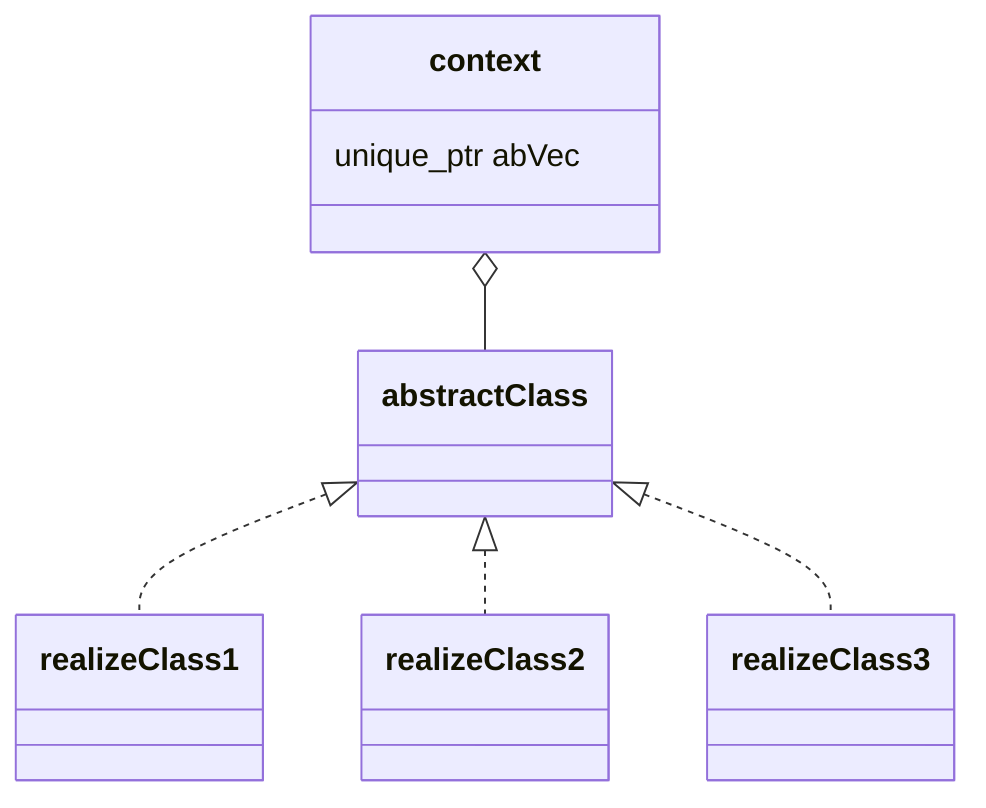
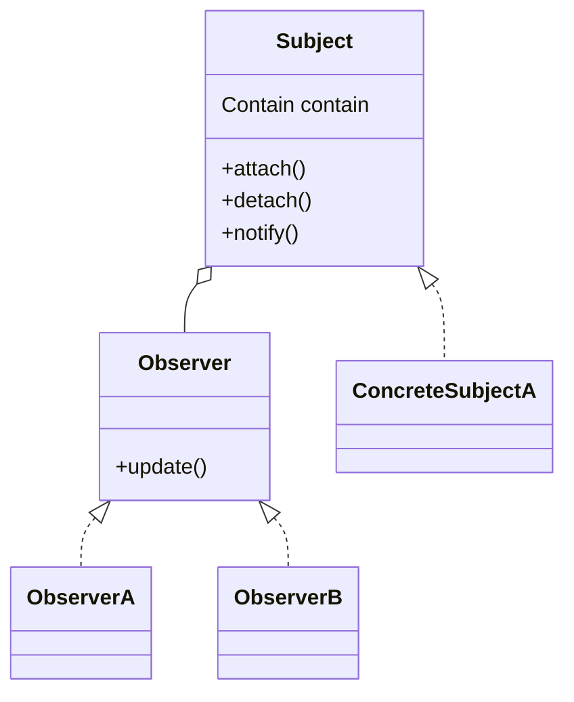
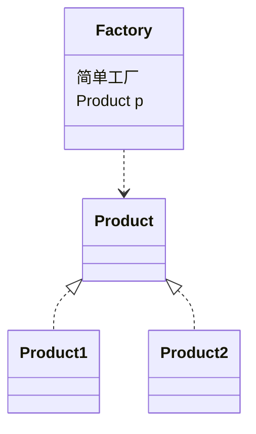
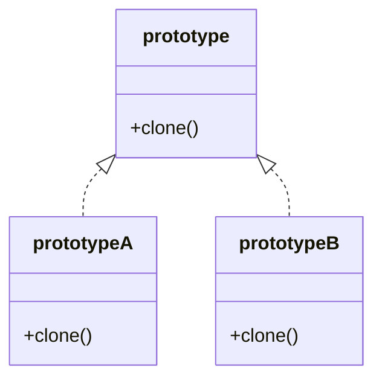
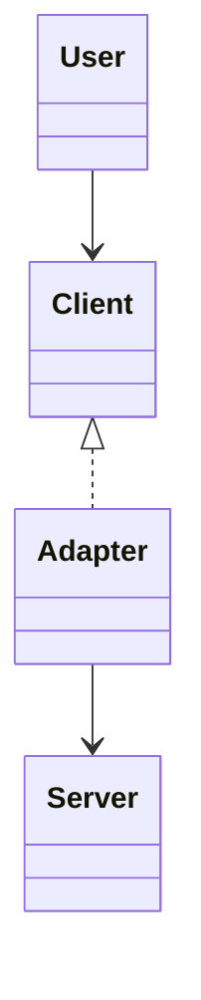

# 闲隙碎笔

## *设计模式*

### 策略模式（行为类）

~~~c++
//策略模式：
//抽象类：对一个策略的抽象，例如strategyMethod();
//实现类：对抽象的实现
//上下文：使用某个具体策略对象来执行

class DiscountStrategy
{
public:
    virtual ~DiscountStrategy() = default;
    
    virtual void applyDiscount() = 0;
};

class NoDiscount : public DiscountStrategy
{
public:
    void applyDiscount() override;
};

class FixedDiscount : public DiscountStrategy
{
public:
    void applyDiscount() override;
};

class Context
{
private:
    std::unique_ptr<DiscountStrategy> strategy_;
public:
    Context(std::unique_ptr<DiscountStrategy> strategy);
    
    ~Context() {}

    void execute();
};

//可以通过enum和map来优化，unorderedmap<enum, Strategy>;
//把所有策略的名字都存到enum，具体的策略对象存到Strategy中，使用map[]来执行具体策略
~~~



### 观察者模式（行为类）

```c++
//有多种类型的观察者，Subject持有一个观察者的容器，用于notify所有

create ConcreteSubject --> notify()
						   notify() --> observer.update()
```




### 工厂模式（创建类）

~~~c++
//用于生产对象，都是忽略了对象的构建过程，封装到类内，直接返回对象
//定义工厂类
class PetFactory
{
public:
    virtual ~PetFactory() = default;
    virtual std::unique_ptr<Pet> createPet() = 0;
};

class CatFactory : PetFactory
{
public:
    CatFactory() {}
    ~CatFactory() {}
    std::unique_ptr<Pet> createPet() override;
};

//定义产品类
class Pet
{
public:
    virtual ~Pet() = default;
    virtual void makeSound() const = 0;
};

class Dog : public Pet
{
public:
    Dog() {}
    ~Dog() {}

    void makeSound() const override;
};

//由工厂类，创建对应的对象
//简单工厂，一个工厂创建所有对象
//工厂，不同的对象由不同的工厂创建

//工厂类和策略类很类似， 
//工厂类是针对对象的创建
//策略类是针对方法的接口的实现
~~~



~~~mermaid
classDiagram
class Factory {
  工厂
}
Product <|.. Product1
Product <|.. Product2
Product <|.. Product3
Factory <|.. Factory1
Factory1 ..> Product1
Factory <|.. Factory2
Factory2 ..> Product2
Factory <|.. Factory3
Factory3 ..< Product3
~~~

~~~mermaid
classDiagram
class Factory {
  抽象工厂
}
Factory <|.. Factory1
Factory1 ..> Product1
Factory1 ..> Phone1

Factory <|.. Factory2
Factory2 ..> Product2
Factory2 ..> Phone2

Factory <|.. Factory3
Factory3 ..> Product3
Factory3 ..> Phone3
~~~

### 单例模式（创建类）

~~~c++
//.h
class Logger_lazy
{
private:
    Logger_lazy();

    Logger_lazy(const Logger_lazy &) = delete;

    Logger_lazy operator=(const Logger_lazy&) = delete;

    static std::once_flag initInstanceFlag;

    static std::shared_ptr<Logger_lazy> logger_;
public:
    static std::shared_ptr<Logger_lazy> getInstance();
};

//.cpp
std::once_flag Logger_lazy::initInstanceFlag;

std::shared_ptr<Logger_lazy> Logger_lazy::logger_;

std::shared_ptr<Logger_lazy> Logger_lazy::getInstance()
{
    std::call_once(initInstanceFlag, []() {
        Logger_lazy::logger_ = std::shared_ptr<Logger_lazy>(new Logger_lazy());
        // Logger_lazy::logger_.reset(new Logger_lazy());
    });
    return Logger_lazy::logger_;
}

//单例模式：只维持一个静态对象，构造函数私有，通过getInstance来获取对象。分懒汉式、饿汉式
//懒汉式：只有在使用的getInstace才创建对象
//饿汉式：在类的初始化时，就创建对象

//tips
//1.懒汉式是线程不安全的，因为没有初始化，有可能多个线程同时创建实例
//2.对懒汉式的改造，std::once_flag代表只会执行一次的对象，std::call_once(std::once_flag, *func)，如此在多线程，func就只会执行一次，所以在此对懒汉式的实例进行初始化
//3.由于构造函数是私有的，所以外部不能new，可以在类内定义一个静态方法，用于构造，在需要调用的时候使用该函数
//4.使用shared_ptr来内存管理时，由于构造时私有的，所有使用make_shared是不可以，使用shared_ptr<Class>(new Class);
~~~

### 原型模式（创建性）

```c++
//自我复制，实现clone借口，返回拷贝后的对象。需要实现拷贝构造
class Shape
{
public:
    virtual ~Shape() = default;

    virtual std::unique_ptr<Shape> clone() const = 0;

    virtual void draw() const = 0;
};

class Circle : public Shape
{
private:
    double radius_;
public:
    Circle(double radius);

    Circle(const Circle &circle);

    std::unique_ptr<Shape> clone() const override;

    void draw() const override;
};

std::unique_ptr<Shape> Circle::clone() const
{
    return std::make_unique<Circle>(*this);//调用拷贝构造
}

int main() {
    Circle　circle(5);
	auto newCircle = circle.clone();
}
```



工厂方法模式、抽象工厂模式、建造者模式和原型模式都是创建型模式。工厂方法模式适用于生产较复杂，一个工厂生产单一的一种产品的时候；抽象工厂模式适用于一个工厂生产多个相互依赖的产品；建造者模式着重于复杂对象的一步一步创建，组装产品的过程，并在创建的过程中，可以控制每一个简单对象的创建；原型模式则更强调的是从自身复制自己，创建要给和自己一模一样的对象。

### 适配器模式（结构类）



```c++
class Client {
public:
  virtual void Func() = 0;
};
class Server {
public:
  void newFunc();
};
// 继承需要适配的，持有适配资源，通过重写虚函数实现函数的重写
class Adapter : public Client {
public:
  Adapter(Server *server) : server_(server)
  {}
  void Func() override
  {
      server_->newFunc();
  }
private:
    Server *server_;
};

int main()
{
    Server server;
    Client *client = new Adapter(&server);
    client->Func();
    delete client;
}
```

#### 多继承下

~~~mermaid
classDiagram

User --> Client
Client <|-- Adapter
Server <|-- Adapter

~~~

~~~c++
class Client {
public:
  virtual void Func() = 0;
};
class Server {
public:
  void newFunc();
};
// 多继承，适配器直接继承双方
class Adapter : public Client, private Server {
public:
    void Func() override
    {
        newFunc();
    }
}

int main()
{
    Adapter adapter;
    adapter.Func();
}
~~~

## *重构*

### 技巧

1. 尽可能少的局部变量

   ```c++
   
   ```

2. 


## *数据结构*

map的实现机理

```c++
map的内部实现了一个红黑树（红黑树是非严格平衡的二叉搜索树，而AVL是严格平衡的二叉搜索树），红黑树又自动排序的功能，因此map内部所有的元素都是有序的，红黑树的每一个节点都代表着map的一个元素。因此，对于map进行的查找、删除、添加等一系列的操作都相当于是对红黑树进行的操作。map中的元素是按照二叉树（又名二叉查找树、二叉排序树）存储的。特点是左子树的所有节点的键值都小于根节点的，右子树的所有节点的键值都大于根节点的。使用中序遍历可按键值从小到大遍历出来。
```

unordered_map实现机理

```c++
unordered_map内部实现了一个哈希表，通过把关键码映射到Hash表中一个位置来访问记录，查找时间复杂度可达O(1)，无序的。
```
