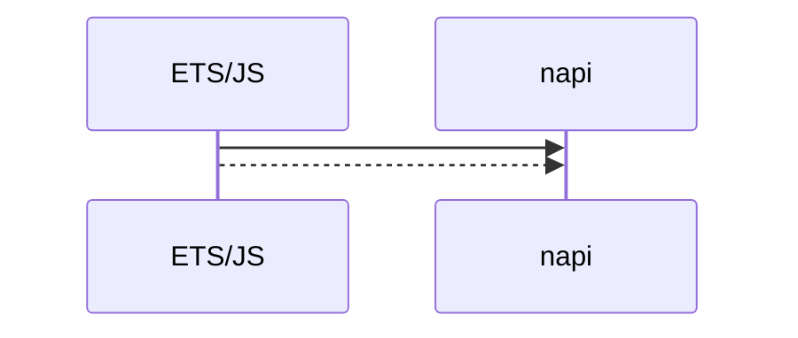
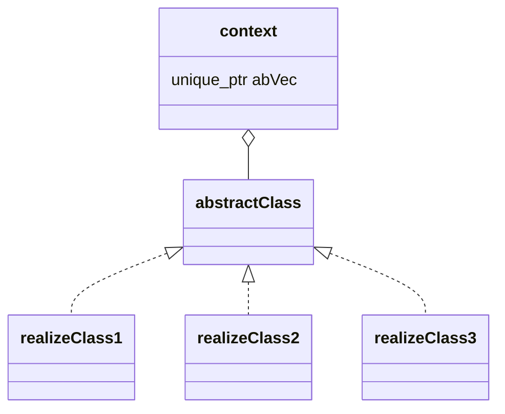
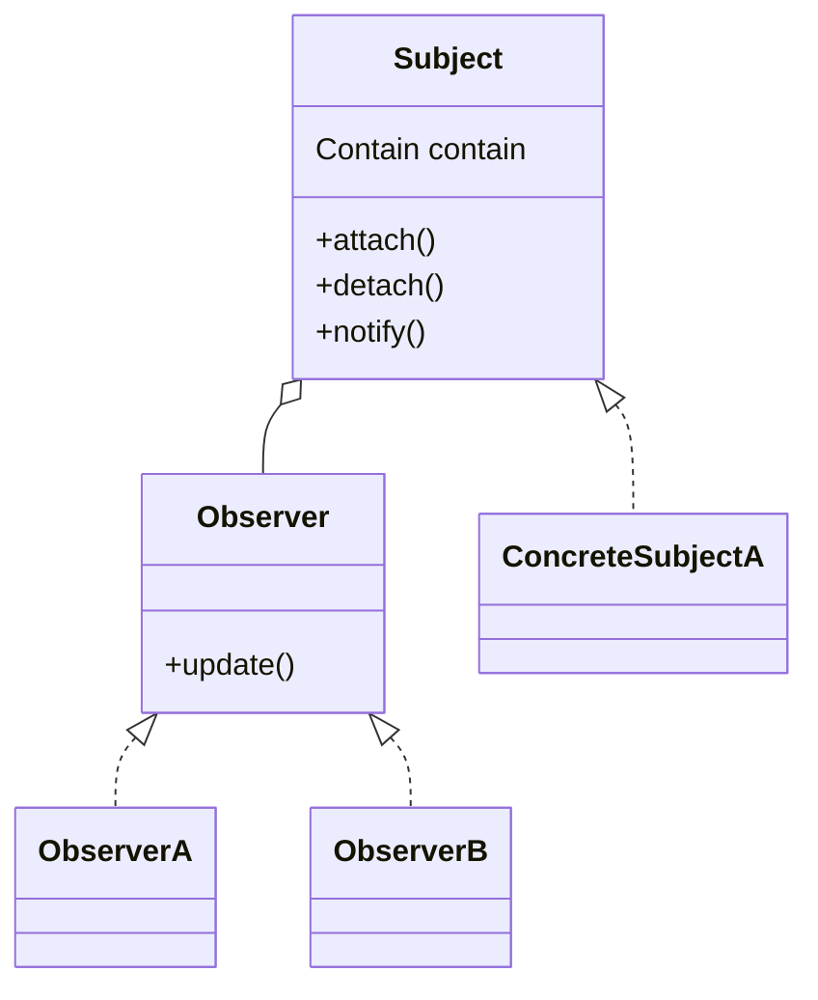
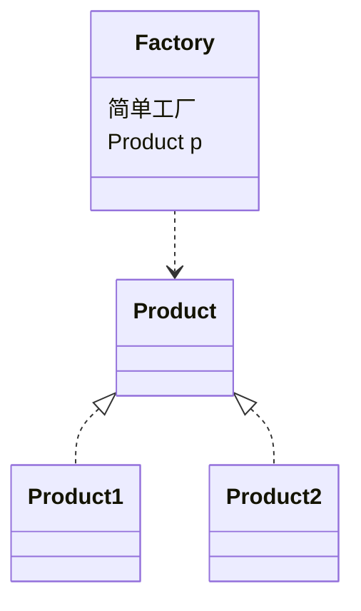
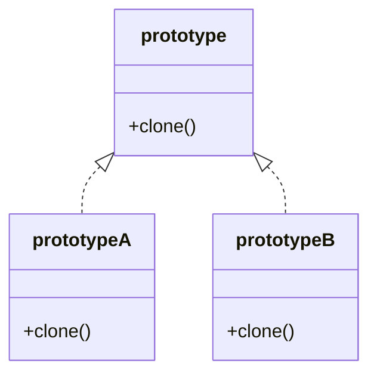
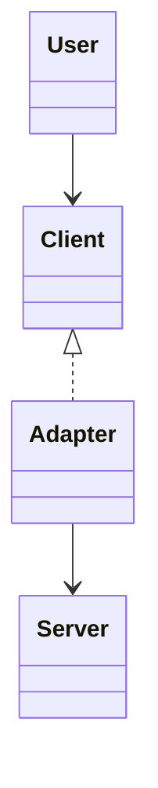
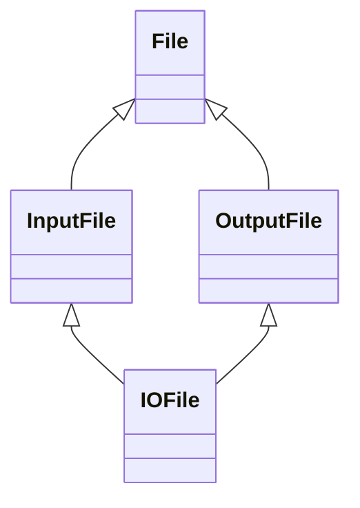

# 闲隙碎笔

## *Todo*

~~~tex
1. 真应该学学怎么写makefile, 了解一下编译的原理以及流程
~~~


## *C*

### 头文件包含顺序

### 全局变量和局部变量

|          | 全局变量                                               | 局部变量                     |
| -------- | ------------------------------------------------------ | ---------------------------- |
| 作用域   | 在整个程序中都可见                                     | 在定义它的代码块中           |
| 生命周期 | 伴随着程序启动到结束                                   | 代码块结束时，局部变量被销毁 |
| 存储位置 | 静态数据区                                             | 存储在栈中                   |
| 默认值   | 未经初始化时，会被赋予默认初始值                       | 不会被自动初始化             |
| 关键字   | 可以使用extern在一个文件中声明另一个文件定义的全局变量 | 无需，除非想定义static       |

### 从代码到可执行的二进制文件

1. 预处理：将宏定义`（#define）`、头文件`#include`等都展开到源文件中，生成`.i`文件。
2. 编译：对预处理后的文件，对其进行语法分析等，将`.i`生成`.s`文件。
3. 汇编：将`.s`文件生成`.o`的二进制代码。
4. 链接：将所有的目标文件链接到一起形成可执行文件，分为动态链接和静态链接
   - 静态链接：将链接库的代码复制到可执行程序中，使得可执行程序体积变大。
   - 动态链接：需要链接的代码放到一个可共享对象中，共享对象映射到进程虚拟地址空间，链接程序记录可执行程序将来需要的代码信息，根据这些信息快速定位相应的代码片段。

### strcpy和memcpy的区别

1. strcpy:专门用于字符串的复制.
2. memcpy:用于复制任意类型的内存块,不仅限于字符串.

~~~c++
int main() {
    char src[] = "i am tobbe";
    char des[20];
    strcpy(des, src);
    memcpy(des, src, sizeof(src));
}
~~~

### 指针数组和数组指针的区别

~~~c++
// 指针数组
int *arr[5]; // 声明一个包含五个指向整数的指针的数组
// 数组指针
int (*arr)[5] = &arr; // 声明一个包含五个整数的数组的指针
~~~

### malloc和calloc的区别

- `malloc` 用于分配指定字节数的内存，内容未初始化。
- `calloc` 用于分配指定数量和大小的元素的内存，内容被初始化为零。
- 在使用 `malloc` 分配内存后，可能需要手动初始化内存内容。
- 在使用 `calloc` 分配内存后，可以确保内存内容为零。
- 在检查内存分配是否成功时，都需要检查返回值是否为 `NULL`。

~~~c++
int main() {
    int *arr = (int*)malloc(5 * sizeof(int)); // 分配地址默认是void *, 所以要转换成int *
    int *arr = (int*)calloc(5, sizeof(int));
}
~~~

### 原码、反码、补码

- 反码是在原码的基础上，负数的表示方式取反。正数的反码和原码相同。
- 补码是在反码的基础上，再加1。
- 补码的性质：
  1. 加法和减法一致： 在计算机中，加法和减法使用相同的硬件电路，无需额外的减法电路。
  2. 唯一的零表示： 补码中只有一个零表示，避免了正零和负零的问题。
  3. 范围表示： 补码表示范围为 −2^(*n*−1),2^(*n*−1)−1，其中 n 是位数。
  4. 溢出处理： 溢出的结果可以被忽略，不会导致错误的计算结果。

### 内联函数和函数的区别

1. 内联函数（Inline Function）：

- 定义： 内联函数是在函数声明前面加上 `inline` 关键字的函数，通常在头文件中定义。编译器会尝试将内联函数的代码插入到每个调用它的地方，而不是通过正常的函数调用机制。
- 特点：
  - 提高代码执行效率，减少函数调用开销。
  - 适用于短小的函数，避免频繁的函数调用带来的开销。

2. 普通函数：

- 定义： 普通函数是一般的函数，不带 `inline` 关键字。函数调用时，会按照正常的函数调用机制执行，包括压栈、跳转、返回等步骤。
- 特点：
  - 函数调用会有一定的开销，包括压栈、跳转、返回等操作。
  - 适用于较大或者复杂的函数，不适合频繁调用。

### 大端对齐与小端对齐

- 大端对齐：数据的最高有效字节,存储在最低地址处.
- 小端对齐：数据的最低有效字节,存储在最低地址处

~~~c++
例如0x1234
高地址		低地址
大端对齐
[12][34]
小端对齐
[34][12]
~~~

### 常量指针与指针常量的区别

~~~c++
// 常量指针
const int * ptr; // 修饰的是对象, 所以指针所指向的对象不能修改. 可以改变指向.
// 指针常量
int * const ptr; // 修饰的是指针, 所以指针不能指向别人, 内容可以改变.
// 必须要初始化 int * const ptr = &a;
~~~

### 声明和定义的区别

|          | 声明           | 定义                |
| -------- | -------------- | ------------------- |
| 内存分配 | 不分配实际内存 | 分配内存            |
| 关键字   | extern or not  | int, double, floate |
| 初始化   | 不进行初始化   | 进行初始化          |
| 多次声明 | 可以多次声明   | 只能定义一次        |

### 什么情况会出现野指针

1. 指针释放后未置空:

   ~~~c
   int *ptr = (int*)malloc(sizeof(int));
   free(ptr);
   // 释放后, 未置为NULL
   ~~~

2. 指针未初始化

   ~~~c
   int *ptr;
   // 未初始化, 包含不确定的地址
   ~~~

3. 函数返回局部变量地址

   ~~~c
   int& returnLocal()
   {
       int num = 4;
       return &num;
   }
   ~~~

4. 指针越界访问

   ~~~c
   int *arr = (int*)malloc(5 * sizeof(int));
   arr[5] = 10; // 越界访问
   ~~~

5. 二次释放

   ~~~c
   int *ptr = (int*)malloc(5 * sizeof(int));
   free(ptr);
   free(ptr); // 二次释放
   ~~~

6. 指针拷贝问题

   ~~~c
   // 当两个指针都指向同一个地址, 其中一个指针释放后, 另外一个指针仍在使用, 导致野指针
   int *ptr = (int*)malloc(sizeof(int));
   int *ptr1 = ptr;
   free(ptr);
   *ptr1 = 10; // 使用了已经释放的内存
   ~~~

   ### 浅拷贝与深拷贝

   - 浅拷贝:浅拷贝通常是通过将一个结构体或数组的内容复制到另一个结构体或数组中来实现的。这只涉及到对结构体或数组的直接成员的复制，而不涉及到成员可能指向的动态分配内存的内容。
   - 深拷贝:深拷贝通常涉及到手动管理动态分配内存，并将内容复制到新的内存空间。这需要使用 `malloc` 和 `free` 函数来管理内存。

   ### 静态函数与普通函数的区别

   |                | 静态函数(非成员函数)                                       | 普通函数                       |
   | -------------- | ---------------------------------------------------------- | ------------------------------ |
   | 生命周期       | 整个程序的生命周期                                         | 只有在函数被调用的时候才存在   |
   | 作用域         | 只有在定义的源文件, 在其他源文件无法调用                   | 只要他们的声明可见, 都可以调用 |
   | 编译单元和链接 | 仅在定义它的编译单元中可见, 链接时, 其他笔编译单元无法访问 | 链接时, 对所有编译单元可见     |
   | 函数名的重用   | 不同编译单元可以定义相同名的静态函数                       | 不可以定义相同名的函数         |

   

## *Cpp*

### 关键字

#### static

~~~c++
经过static修饰的变量为静态变量，存在静态区中。存在静态区的数据生命周期与程序相同。在main函数之前初始化，在程序退出时销毁。（无论是全局静态还是局部静态）
~~~

#### using

~~~c++
using 别名 = 主名(更多是用在命名空间的重命名)，typedef(用于类、结构的重命名)。
using Func = std::function<void(int)>;
Func printNum = [&](int num) -> int { std::cout << num << std::endl; };
~~~

#### explicit

~~~c++
explicit 修饰构造函数，表示该构造不能隐式转换，也就是不能 string sName = "tobbe"，只能string sName = string(tobbe)。
防止构造函数，进行类型转换。鼓励构造函数中使用explicit
    
// non-explicit, could apple this constructor
testFuncion(10);
// explicit
testFuncion(Test(10));

// 会报错, 因为explicit禁止了隐式调用拷贝构造函数。
Widget widget = w1;
~~~

#### const

```c++
const函数，常量和非常量对象都可以调用const函数，但是在const不能修改成员变量，常量对象只能调用常量函数。
```

#### extern

~~~c++
extern，是简单的声明，不分配内存：
// 用法1：在一个.h文件定义int i，在另外一个extern int i，就可以跨文件使用这个变量

// 用法2：在变量很多文件都有涉及，那么在一个头文件中定义extern int i, extern int j,在不同文件中引入该头文件就可以直接使用。

// 用法3：extern "C" {/**/}，就代表代码块中使用C的语法，例如C++支持重载，而extern "C"修饰后，就不能重载了。

// common.h
extern int g_num;
// 如果很多源文件引入该头文件，如果没有extern修饰，就会报错，因为int g_num；是声明
// 说的可以跨文件共享，是指可以在引入该头文件的文件之间共享
~~~

#### define

~~~c++
#define，定义宏，只是单纯的替换：
// 用法1：定义一个宏，#define MAX_VALUE 1000。遇到MAX_VALUE 就会替换成1000。

// 用法2：定义一个函数, #define Add(x, y) x +y。这里只会简单的替换，例如，a * Add(x, y) * b，a * x + y * b, 这里遵循交换律。 

// 用法3：#define ToString(x) #x， #define ToChar(x) #@x，#define Conn(x, y) x##y。##表示连接，#@表给''引上，#给""引上。

// 用法4：条件判断，(#ifdef || #ifndef #else #endif)，取消宏定义#undef。

// 用法5：多行定义，
#define METHOD_MAP(XX)	\
		XX(getId)		\
		XX(getMenu)		\
		XX(getColor)
等价于#define METHOD_MAP(XX) XX(getId) XX(getMenu) XX(getColor)

#define DECLARE_METHOD(methodName) void methodName(void); 
METHOD_MAP(DECLARE_METHOD)  等价于把所有的函数都声明了
这种用于元编程，要批量操作一系列函数时，

// 技巧：当想创立一个自定义变量的数组，那么就得先把自定义类型给定义了，可以使用匿名结构体
struct {
  DeviceinfoMethod id;
  const char *methodName;
} METHOD_NAME[] = {
  /* 这里可以用元编程，使用宏来批量操作*/
}
~~~

#### typename

~~~c++
int main() {
    // 1. typename指明后面是一个类
    template<typename T>  
    typename T::SubType* ptr；
    // 2. typename指模板类
	template<template<typename, typename> class Container, typename Key, typename Value>  
    Container<Key, Value> data;
}
~~~

#### constexpr

   ```c++
// constexpr关键字修饰的，表示该对象在编译时就会确定的值，如果不是那么在编译时就会报错，减少了运行时间

constexpr 函数：可以在编译时计算结果，但要求所有参数都是常量表达式。
    数组大小：必须是常量表达式。
    模板参数：必须是常量表达式。
    常量对象：可以在编译时确定，但非 constexpr 方法仍然在运行时调用。
    编译错误：如果 constexpr 函数的参数不是常量表达式，编译器会报错。
    
    constexpr int size = 10;
    是在编译的时候就确定的值，而不是在运行时确定的值，例如给 arr[size]赋值，这个size是要在编译时就知道的值好分配内存空间，
  
   ```

#### union

~~~c++
union Data {
int i;
float f;
char str[20];
};
// 于struct，不同的时，union的大小为成员中最大的，如char str[]为20字节
Data data;
data.i = 10;
data.f = 10.5; // 此时就没有i值了
~~~

#### volatile
~~~c++

~~~

#### public, private

~~~c++
Base类有纯虚函数, 表示该类无法被实例化(抽象类), 且继承的派生类也必须要重写该函数. 而如果派生类也为抽象类, 则不必重写纯虚函数.
总结则为: 在继承关系下, 如果存在纯虚函数, 则需要实例化的类必须要重写纯虚函数.

在private继承下, 无法多态, 且遮蔽所有的基类方法, 内部仍然可以调用基类的public, protected方法, 而外部则无法调用.
class Base {
public:
    virtual void func1();
};
class Derived : private Base {  
public:
    void callfun1()
    {
        func1();
    }
};
int main()
{
    Derived d;
    d.callfunc(); // 可以, 转交函数
    d.func1(); // 不可以, private继承下func1为private, 无法在外部调用
    Base *b = &d; // private继承下, 无法多态
}
~~~


### 语法类

#### 虚继承

~~~c++
虚继承，当出现菱形继承时，23分别是1的子类，4同时继承2，3。把2.3改为virtual public 1；是为了防止2.3和1有相同名字的成员变量，而4继承后不知道是用谁的值，导致二义性。此时4的成员变量值为最右侧继承基类的值。
~~~

#### 代码块

~~~c++
代码块{}，就是块内的代码，块外访问不到。搭配一些例如lock_guard，出代码块的作用域，会自动释放资源。
~~~

#### 在头文件定义的inline和模板函数

~~~c++
//.h
void fun();
//.cpp
#include ".h"
void fun() {};
//main.cpp
#include ".h"
int main() {
    func();
}

//预处理
//编译，分别编译.cpp和main.cpp,生成.o和main.o文件
.cpp，编译器看到函数的声明和定义，对于普通函数，只需要知道声明，不用需要知道实现，但是需要有
.main，编译器看到了声明，
//链接
.main对于func()的调用，找到.o文件中的实现，把他们链接起来

/*内联函数：需要在头文件中定义，因为编译器需要在每个调用点处看到内联函数的完整定义。
静态成员函数：可以在类内定义，以提高代码的可读性和模块化。
构造函数和析构函数：可以在类内定义，以提高代码的可读性和模块化。
简单的成员函数：可以在类内定义，以提高代码的可读性和模块化。
常量表达式函数：需要在头文件中定义，因为编译器需要在每个调用点处看到函数的完整定义
*/

而对于内联、模板和常量表达式函数需要在头文件定义，因为这些函数都是在编译时必须知道的。所以不能像普通函数，在编译时不用知道，在链接时知道即可。
如果没在头文件中定义，那么main.cpp在预处理把头文件展开，编译时就可以知道他的定义。
~~~

#### 左值、右值引用

~~~c++
//左值和右值引用实际都为引用
//右值引用，右值不可以取x + y的地址，但是可以取a的地址&a，
int &&a = x + y;
//并且右值不能被左值赋值，如果需要左值赋值，使用std::move()
int &&a = x; //×
int &&a = std::move(x); //√

//左值引用
//而左值也只能被左值所赋值
int &a = x;//√
int &a = 1;//×
//但是const修饰后的左值，都可以被赋值
const int &x = 1;//√

//拷贝构造函数和移动构造函数都是对构造函数的重载，不同的是，拷贝构造函数接受的参数是const左值，左值和右值，而移动构造函数接受的参数是右值和被move的左值。


//完美转发，用于万能引用，等同于模板右值引用。std::forward<>,正常来说，传左值或右值给函数时，会以左值或右值引用进行传递，而forword是用于传参时，右值被强制转换为左值。万能引用是和T模板相结合，T&& a, 为万能引用。而Test&& a为右值引用，const T&& a也为右值引用。
std::forward<T> (x);//只要是右值引用，由当前函数再传递给其它函数调用，要保持右值属性，必须实现完美转发。

//不能返回局部变量的引用，并且不能返回由new创建的对象。第一条，因为局部变量离开作用域就被析构了，而局部变量的引用就变成“无所指”的情况。第二条，虽然不会出现没有指向的情况，但是new出来的对象，如果没有赋值给一个实际变量，从而delete不了，造成内存泄漏。
~~~

#### 左右折叠，template，typename...

~~~c++
//左折叠
//属于c++17的新特性，g++ -std=c++1z main.cpp -o main才可以编译
template<typename... Args>
void print(Args... agrs) {//args op ...
    (std::cout << ... << agrs) << std::endl;
    return (... && args);//所有参数为真
    return (... || args);//至少有一个参数为真
    return (args + ... + 0);//求和
    return (args * ... * 1);//求积
    return (... > args ? ... : agrs);//求最大值
    return (... + (args > 0 ? args : 0));//大于0的数相加
}
//右折叠
template<typename... Args>
void func(Args... args) {
    std::cout << (args * ... * 1) << std::endl;
}
int main() {
    print("hello", " world!");//hello world!
}

//template
//不能共享，每一个函数都得独立声明；且只能在声明的模板内有效；
template<typename... N>//也可以定义一个固定类型的参数包
template<int... N>//也可以定义一个固定类型的参数包

template<typename N>//typename可以使任何一个类，也可以指定固定类，例如int
void test() {}
test<int/5>();
~~~

#### static局部变量

~~~c++
void func()
{
    static int num = 10;
}
// 只要是静态变量，其的声明周期都是全局的
// 与全局静态不同的是，局部静态是在第一次访问时分配值i，并且其的作用域只是在对应的代码块中
~~~

#### 虚析构函数

如果类可能被继承，并且可能被基类指针删除，析构函数应该声明为 `virtual`。

- 没有定义虚析构函数时，有可能执行子类的析构后不会执行父类的析构函数

#### 构造函数

~~~c++
Widget w1; // default constructor
Widget w2(w1); // copy constructor
// 区分拷贝构造和拷贝赋值
// 当有新对象创建的时候, 肯定会有构造
// 因为 explicit禁止了隐式调用拷贝构造函数。
Widget widget = w1; // copy constructor
// 反之, 当没有的时候, 则就是赋值
w1 = w2; // assignment operator
~~~

#### 类型转换

~~~c++
//1. static_cast, 用于在编译时就知道的类型, 不进行运行时类型检查, 不能去除const, volatile限定符
int i = 10;
double d = static_cast<double>(i);
Base *b = new Derived();
Derived *d = static_cast<Derived*>(b); // 不安全

//2. dynamic_cast, 用于多态中向下类型转换
Base *b = new Derived();
Derived *d = static_cast<Derived*>(b); // 安全
if d() {} // 如果转换成功

// 3. const_cast, 用于添加或移除const, volatile限定符
// 唯一合法的场景, 变量本身就不是const, 可以使用const_cast给const修饰符移除
int y = 10;
const int& cref = y;
int& ref = const_cast<int&>(cref);
ref = 20; // OK, 因为y本身就不是const的

// 4. reinterpret_cast, 最危险, 用于不同类型的互相转换
~~~


### 接口类

#### std::move

~~~c++
//std::move
string ch = "tobbe";
string&& str = std::move(ch);//左值不能赋值给右值，通过move来转换 
str.push_back();//通过传入引用,将左值引用转换成右值引用，提高内存操作效率
~~~

#### std::ref

#### std::advance

#### std::tuple、std::tie，std::get\<N\>

~~~c++
std:tuple<bool, int> getPath() {
    return make_tuple(true, 10);
}
int main {
    auto[succ, num] = getPath();//c++17之后才允许的，结构化绑定，用来赋值，succ和num都是临时变量
}
//而tie用来更新值
class Person {
    int age;
    string name;
}
int main() {
    Person p;
    std::tie(p.age, p.name) = make_tuple(1, "yike");

    std::tuple<int, std::string> myTuple = {42, "Hello, World!"};  

    int firstElement = std::get<0>(myTuple);
}
~~~

#### std::make_index_sequence<>

~~~c++
//std::make_index_sequence<5>，为一个模板类，为sequence<0,1,2,3,4>
template<size_t... N>
void test(std::index_sequence<N...>) {
    (std::cout << ... << N) << std::endl;
}
int main() {
    // execute("hello ", "world!");
    // execute(1, 2, 3, 4, 5);
    // execute1(1, 2, 3, "tobbe");
    // std::cout << "right fold" << std::endl;
    // execute2(1, 2, 3, "tobbe");
    test(std::make_index_sequence<5>{});
}
~~~


### 多线程

#### 多线程-操作

~~~c++
int task(int num) {
    std::cout << "thread Id: " << std::this_thread::get_id() << std::endl;
    return num * num;
}
void task1(int num, std::promise<int> &promise) {
    promise.set_value(num * num);
}
void task2(shared_future<int> f) {
    int num = f.get();
}
int main()
{
    // 1.1 抛线程-没有返回值
    std::thread t(task, 5);
    t.join();

    // 1.2 抛线程-有返回值
    std::promise<int> promise;
    auto futures = promise.get_future();
    std::thread t(task1, 5, std::ref(promise));
    std::cout << futures.get() << std::endl;
    t.join();
    
    // 2.1 抛异步任务
    auto res1 = std::async(std::launch::async, task, 5); //直接在后台执行
    auto res = std::async(std::launch::deferred, task, 5); //等get后才开始执行
    
    // 2.2 抛异步任务
    shared_future<int> f = res1.share();
    std::thread t1(task2, f);//把一个异步的结果，传给另外一个线程
	auto res2 = std::async(std::launch::async, task2, f);
    
    t1.join();
    res2.get();
}

//抛线程与抛异步任务
//线程：适用于比较长的计算，且无法返回值，需要搭配promise
//异步任务：更加轻量级，可以返回值
//通过shared，可以把一个异步任务的结果，传给另外一个线程，或者任务
~~~

#### 多线程-锁

```c++
//1.锁
std::mutex mtx;
int count = 0;

void func() {
    for (size_t i = 0; i < 1000; ++i) {
        std::lock_guard<std::mutex> lock(mtx);
        count++;
    }
}
int main() {
    std::vector<std::thread> threads(5);
    while(int i < 5) {
        threads.emplace_back(func);
    }
    for(auto &t : threads) {
        if(!t.joinable()) continue;
        t.join();
    }
}
//2.信号量 c++20
std::counting_semaphore<1000> sem(1);//1000代表最高并发量，1表示许可的个数
void func() {
    sem.acquire();
    ++counter;
    sem.release();
}
//3.条件变量
std::mutex mtx;
std::condition_variable cv;
bool ready = false;
void producer() {
    {
        std::lock_guard<std::mutex> lock(mtx);
        ++count;
        ready = true;
    }
    cv.notify_one();//唤醒另外一个线程
}
void consumer() {
    std::lock_guard<std::mutex> lock(mtx);
    cv.wait(lock, []() { return ready; })//等待ready为true
}
//原子操作
std::atomic<int> count(0);
void func() {
    for (size_t i = 0; i < 1000; ++i) {
        count++;
    }
}
//
```

#### std::thread_local

```c++
/*线程隔离：每个线程都有自己的变量副本，因此访问和修改这些变量时不会影响到其他线程。
  避免同步：由于每个线程操作的是自己的变量副本，因此无需使用锁或其他同步机制来避免数据竞争。
  空间换时间：通过为每个线程分配独立的变量副本，ThreadLocal以空间换时间的方式解决了线程安全问题。*/
thread NClass nclass;
//每个线程的都存在的各自的局部变量
```

#### std::thread

~~~c++
std::vector<std::thread> ts;

ts.emplace_back(arg1, arg2);//arg1是线程函数（如拿糖果），arg2是传给线程函数的参数

ts.emplace_back();//是在容器的尾部直接创建新的对象，而不是创建一个再移动或复制

ts.emplace_back(func, std::ref(jar));//ts.emplace_back里面是值传递，而不是引用，到需要引用传递时，std::ref()可以将其转换为引用
~~~

#### std::async

~~~c++
 //
 std::future = std::async(std:launch::async, callback, arg...);
 auto res = future.get();
~~~

#### std::promise

~~~c++
 std::promise<int> promise;
 auto future = promise.get_future();
 
 std::thread t1([](std::promise<int> promise, int num) {
     promise.set_value(num * num);
 }, std::move(promise), 7);
 
 auto res = future.get();
~~~

### STL容器

#### 迭代器

~~~c++
//list,set,map的迭代器不支持+，-操作
std::unordered_set<int>::const_iterator it = hash.begin();
it++;
it--; //不支持
it += 5;//不支持
std::advance(it, 5);//可以对所有类型的迭代器，进行+操作
~~~

#### 容器存放指针

~~~c++
//STL的容器是自动管理内存的，但如果存放的是指针，例如
std::vector<int *> intVec(5);
for(size_t i = 0; i < 5; ++i) intVec.emplace_back(new int(5));
~~~

#### 容器的定义和初始化

~~~c++
//容器的定义
//1.另外一个容器的拷贝，2.另外一个容器的迭代器范围
//1.
vector<int> ivec;
list<int> ilist(ivec);//容器拷贝，数据类型必须一致，
//2.只有array和string容器不支持
vector<string> svec;
list<const char *> chlist(svec,begin(), svec,end());//只要数据类型可以互相转换即可

//容器的初始化
//1.同定义，拷贝必须类型相同，迭代器数据类型必须可以转换
std::list<char *> chlist;
std::vector<std::string> strvec;
strvec.assign(chlist.begin(), chlist.end());
~~~

#### insert和emplace的区别

~~~c++
class Two
{
    Two(int n1, int n2);
};
vector<Two> vec;
//insert是先创建对象在拷贝到容器中
Two t(1, 2);
vec.insert(vec.begin(), t);
//emplace是直接在容器调用构造函数
vec.insert(vec.begin(), 1, 2);//错
vec.emplace(vec.begin(), 1, 2);//对
~~~

#### 适配器stack，queue，priority_queue

~~~c++
//适配器，用来修饰容器
vector<int> vec;
stack<int, vector<int>> stk(vec);

//queue，priority_queue，可以修饰deque和list
deque<int> deq；
list<int> ls;

~~~

#### 关联容器

~~~C++
/*
	<key, value>
	set/map
	multiset/map
	unorderedset/map
*/ 
1.只有重载了"<"操作符，才可以作为关键字的类型
2.通过begin等返回的迭代器为 pair<const key, value>，所以不能修改值，
auto it = map.begin();
it->fist = "new kek";//错
it->second = 15//可以
~~~

### 泛型算法

泛型算法不依赖容器，但是依赖元素类型。
例如，std::find()，需要元素类型支持==，其他算法需要元素类型支持<操作符
算法大多数都是，func(iter, iter, init);都是传入一个迭代器的范围

#### std::find

~~~C++
/*
	in	: 迭代器范围
	out	: 找到的迭代器
*/
//std::find
auto it = std::find(vec.begin(), vec.end(), 5);//查找范围，返回的是迭代器

//std::find_if，传入谓词，lambda表达式
auto it = std::find_if(vec.begin(), vec.end(), [](int num) {
    return num > 10;
});

//对于以下有成员方法find，用自己的。要求通用性，使用泛型算法，所有容器都能使用
sting s;
size_t index = s.find("1");//返回的是下标
~~~

#### std::all_of

~~~c++
/*
	in	: 迭代器范围，谓词
	out	: 元素对谓词的结果 
*/
//all_of
auto status = std::all_of(vec.begin(), vec.end(), [](int num) {
    return num > 0;//all_of所有元素都得满足条件，为true
});

//none_of
status = std::none_of(vec.begin(), vec.end(), [](int num) {
    return num > 0;//none_of，所有元素都不满足条件，为true
});

//any_of
status = std::any_of(vec.begin(), vec.end(), [](int num) {
    return num > 0;//any_of，有一个元素满足条件，为true
});
~~~

#### std::count

~~~c++
/*
	in	：迭代器范围
	out	：出现次数
*/
//std::count
auto count = std::count(vec.begin(), vec.end(), 3);//返回出现次数

//std::count_if
auto count = std::count_if(vec.begin(), vec.end(), [](int num) {
    return num >= 3;
});
~~~

#### std::copy

~~~c++
/*
	in	: 迭代器范围，拷贝的容器的迭代器
	out	: 指向ivec的指针
*/
auto it = std::copy(vec.begin(), vec.end(), ivec.begin());

std::replace(ivec.begin(), ivec.end(), 5, 6);

auto it1 = std::replace_copy(vec.begin(), vec.end(), ivec.begin(), 5, 1);//vec的内容不变，把vec的5换成1给到ivec

//给需要拷贝的容器为空时，传入begin()为报错，需要使用back_inserter(vec)
~~~


#### 计算算法

```c++
//std::accumulate，计算和
#include <numeric>
int main()
{
    std::vector<int> vec = { 1, 2, 3, 4, 5 };
    std::accumulate(vec.begin(), vec.end(), 0);//传入范围，初始值为0
}
```

#### std::fill

~~~c++
/*
	in	: 迭代器范围，需要填充的值
	out	: 
*/
std::fill(vec.begin(), vec.end(), 5); // 传入一个迭代器范围

std::fill_n(vec.begin(), 5, 1); // 传入一个开始的指针，和要替代的个数，这里个数一定不能越界
~~~

#### 排序算法

~~~c++
std::sort(vec.begin(), vec.end()); // 排序, 对于自定义的数据类, 需要重载<或==

std::stable_sort(vec.begin(), vec.end()); // 当元素相同时, 会保持排序前的顺序

auto it = std::unique(vec.begin(), vec.end()); // 只把相邻相同的元素放到末尾, 返回末尾的迭代器, 所以要排序

vec.erase(it, vec.end()); // 删除重复元素
~~~

#### std::partition

~~~c++
// partition, 接受一个谓词, 分为两个部分, 前面为谓词为true. 返回最后一个谓词为true的迭代器.
auto it = std::partition(vec.begin(), vec.end(), [](int num) {
    return !(num & 1);
});
~~~

#### std::unique

~~~c++
auto it = std::unique(beg, end); // 相邻元素如果相同，给他放到容器尾部。返回重复的头迭代器

auto it = std::unique_copy(beg, end, vecbak.begin()); // 把不同的元素，copy给别的容器
~~~

### 迭代器的适配器

~~~c++
auto it = std::back_inserter(vec); // 返回一个插入迭代器

std::fill_n(it, 5, 1); // 如果传入的是begin()，会报越界错误

// back_inserter对于可扩容的容器，不用考虑越界的问题

// 1.back_inserter，容器必须支持push_back
std::copy(beg, end, std::back_inserter(vecbak));

// 2.front_inserter，容器必须支持push_front
std::copy(beg, end, std::front_inserter(vecbak));

// 3.inserter,容器支持insert
std::copy(beg, end, std::inserter(vecbak, vecbak.begin()));
~~~

### lambda表达式

~~~c++
// 基本格式
[]() -> return {};

// mutable 修饰值传递
[=]() mutable {}; // 捕获的值，在lambda内不能修改，使用mutable修饰后，可以修改。

// 什么时候需要显示 -> return
// 1.多行表达式时
std::transform(vec.begin(), vec.end(), vec.begin(), [](int i) -> int {
	i = i *10;
    return i;
});
// 2.当有多个返回值时
std::transform(vec.begin(), vec.end(), vec.begin(), [](int i) -> int {
    if (i > 0) {
        return i;
    } else {
        return i;
    }
});
// 3.返回值不显而易见时
auto createVector = []() -> std::vector<int> {
    std::vector<int> ivec(10, 5);
    return ivec;
}
// 4.返回值是模板时
auto identity(T value) -> T {
    return value;
}
~~~

### 智能指针

#### unique_ptr

~~~c++
// 初始化
std::unique_ptr<int>(new int(10));
auto ptr = std::make_unique<int>(10);
// 禁止复制，可以移动
int main (int argc, char *agrv) {// 此时ptr1为空，ptr2指向原来的对象
    auto ptr1 = std::make_unique<int>(10);
    std::unique_ptr<int> ptr2 = std::move(ptr1);
}
// 自定义删除器
void customDeleter(int* ptr) {   
    delete ptr;  
}  
int main() {// 接受一个删除器，当离开作用域时自动调用
    // void(*)(int*)，表示返回值为void，void(*)表示是函数指针，而void*则是一个返回指针的函数
    std::unique_ptr<int, void(*)(int*)> ptr(new int(10), customDeleter);  
}
// 支持数组
std::unique_ptr<int[]> arr(new int[5]{1, 2, 3, 4, 5});
// 释放所有权
int* rawPtr = ptr.release(); //需要手动，delete rawPtr
// 重置指针
std::unique_ptr<int, deleter> ptr = std::make_unique<int>(10);  
ptr.reset(new int(20)); // 指向新对象  
ptr.reset(); // 变为空 

make_unique<T[]>(5);//接受一个数组时，是非法的，要求是定长的，不能是动态创建大小，因为是在编译时
// 就和指针一样，也就是ptr=arr数组的名字arr[5] = ptr[5];
// argPath为unique_ptr，而捕获列表有= &,而unique_ptr禁止复制，传&argPath，lambda可以会超出指针的声明周期，所以使用move来操作
lambda：[arg, argPath = move(argPath), argMode = move(argMode)];
// 接受一个删除器，在离开生命周期时会调用删除器，且把持有的资源自动传给删除器，如果资源类型和删除器传参类型不一致，会报错
std::unique_ptr<T, Deleter> ;
~~~

#### std::shared_ptr

~~~c++
当一个类Sale需要共享一个vector，两个对象saleA，saleB都持有vector
当数据需要共享时，使用shared_ptr来修饰，这样动态创建在堆区，创建对象时，就传shared_ptr，直到最后一个持有的对象析构时，才会释放
~~~

### 线程池


## *Linux*

1. Linux查看进程指令，ps -aux第二列是什么，和ps -elf区别。

~~~bash
ps -aux	# 更适合普通用户查看进程的基本信息，比如 CPU 和内存占用。
ps -elf	# 提供了更底层的细节，适合系统管理员进行深入分析
~~~


## *Vim*

### vim基本指令

```cpp
// 移动光标
h	左移，j	下移，k	上移，l	右移

// 删除光标的字符
x

// 替换字符
r	替换当前光标的字符
R	替换多个字符

// 撤销
ctrl r， 或者u

// 复制
yy
    
// 粘贴
p
```

### vim插入

```
i	光标前键入插入模式
I	行头进入插入模式
a	光标后键入插入模式
A	行尾进入插入模式
o	本行后添加一行，并进入插入模式
O	本行前添加一行，并进入插入模式
```

### vim搜索

```c++
:set hls	// 搜索高亮
:set is		// 搜索部分匹配
:set ic		// 搜索忽略大小写

/test 是从前后往后搜索test, ?test 是从后往前搜索test
/test\C /b \C是不忽略大小写，\b是全字匹配

*# 表示搜索光标所在单词

:%s/test/demo 文本中的所有test换成demo

q/ 表示搜索记录
```

### vim删除

~~~shell
# 所有的d换成c，就是删除后进入插入模式
dw	删除单词
d$	删除光标到末尾
dd	是删除整行
3dd	删除三行，类似ctrl x，会到放到寄存器中，p可以粘贴
:%d	删除所有

# 删除块级别
di+对应的符号	删除[],(),{},'',""中的元素
例如, [test] 
di[ -> []
若是想连""也一起删除,就是da
~~~

###  vim跳转

~~~
f + 字符	跳转光标后的第一个该字符的位置
^		行首
$		行首
0		行头
e/w		后移一个单词
b		前移一个单词
gg		移动到文件第一行
G		移动到文件最后一行
gg486	移动到486行，ctrl g是显示行号
%		匹配对应(),[]
*		跳转光标对应字符的下一个位置
#		跳转光标对应字符的上一个位置
~~~

### Vim执行外部命令

```shell
# Vim执行外部命令
:!ls	执行ls的命令
:!rm	执行rm的命令
```

### Vim文件相关操作

~~~shell
# 把文本中一些字段保存到另一文件中
v/V		进入可视模式
移动光标选择需要保存的字段
w TEST	保存为TEST文件

# 在文件中，插入别的文件的内容
:r TEST		可以搭配上面那个用
~~~

## *Git*

~~~bash
# 和对应仓添加关联
git remote add <upstream> <url> # upstream 可以取任意名字, url为对应仓的git地址
git remote remove <upstream>

# 提交代码
git add .
git commit -m "first commit"
git commit --amend
git push origin <branchName> -f

# git rm 删除文件
git rm test/\*.log 			# 删除test/目录下，所有的.log文件
git rm --cached test.txt 	# 删除暂存区中的文件

# git移动文件
git mv <file_form> <file_to>

# git stash
# 暂存，例如在分支a修改了代码，但是实际要提到b分支
git stash
git stash list
git stash pop
git stash pop <@编号>
git stash apply
git stash drop

# 查看某一笔提交的差异
git show <hash> --stat		# 看对应hash提交中有哪些文件修改
git show <HEAD> --shortstat	# 看git log最近一笔的修改的代码行数
    
# 拉远程代码
git fetch upstream
git checkout <upmaster/master> -b <newBranch>

# 显示远程仓和本地仓之间的差异
git log <master>..<origin/master>
git diff <branch1>..<branch2>	# 查看两个分支的代码差异
git diff <branch1>...<branch2>	# 比较从共同祖先到branch2的差异

# git rebase, 变基or解冲突
git fetch <upstream> <master>
git rebase <upstream/master>
git rebase --continue

# 查看历史操作记录, 配合reset达成代码回退
git reflog
git reset --hard <hash>

# 同步其他人对仓库(某分支)的修改, 以分支puec为例
git checkout <master>	# 保证分支puec没有修改, 任意切到其他分支
git branch -D <puec>	# 删除旧分支
git fetch <origin>		# 更新origin, 也就是更新其他人对origin的修改
git checkout <puec> 	# 再切换到更新后的puec分支

# 新提交一笔pr
git checkout <puec_0701> -b <puec_test>
# HEAD为git log的最新一笔提交, HEAD~1表示最新一笔的前一笔提交, --soft会把HEAD与HEAD~1之间的差异放到暂存, --hard则会直接删除
git reset --soft <HEAD~1>
git commit -s
git push origin <puec_test>

# cherry-pick
git cherry-pick <hash>
git cherry-pick --continue	# 继续

git cherry-pick --abort 	# 取消本次cherry-pick

git fetch upstream pull/67227/head:test	# 拉取 PR 提交到本地临时分支
git cherry-pick <hash>					# 应用该提交
~~~


## *UML*

### 类图

~~~mermaid
classDiagram

class tobbe {
	+name string
	+phone string
}
classA --|> classB : 继承 指向父类
classC --* classD : 组合 指向整体
classE --o classF : 聚合 指向整体
classG --> classH : 关联
classK ..> classL : 依赖
classM ..|> classN : 实现
~~~

~~~c++
// 组合关系：生命周期相同。若是成员变量，是以值的形式存在。
// 聚合关系：生命周期各自来决定。若是成员变量，是以引用或指针的的形式存在。其已集合的形式存在。
// 关联关系：类似于聚合关系，不过是一个体的形式存在。
// 依赖关系：成员方法中，使用别的类的方法。从依赖类指向被依赖类。
// 实现关系：指向实现抽象类的接口。由实现类指向抽象类。
~~~

### 时序图





## *JNI*

~~~c++
jniEnv->FindClass(CLASS_NAME); // 用过CLASS_NAME也就是路径找到Java类 
~~~

## *NAPI*

### napi注册过程

~~~tex
napi_defined_class() -> napi_get_prototype() -> napi_create_function() -> napi_set_named_property() -> 注册类 -> 注册模块
    
1.先写好完整的c++的类，包括构造，属性，方法...，通过napi一系列方法，将c++的类注册到js中
2.napi_defined_class():传入c++构造回调，获得js对象
3.napi_get_prototype():传入js对象，获取js对象的属性列表
4.创建js方法，并加入到js对象的属性列表中，napi_create_function():传入c++函数回调，获取该函数对应的js函数。napi_set_named_property()：把该js函数设置到对应的js对象的属性列表中，传入js对象的属性列表prototype和js函数method，静态方法传入的就是js对象和js函数
5.把整个Myclass类到入到js中，napi_set_named_property()
6.最后模块的注册
~~~

#### napi_define_class

~~~c++
napi_status napi_define_class(napi_env env,// 操作的句柄
                              const char* utf8name,// 类名
                              size_t length,// 类名的长度
                              napi_callback constructor,// c++类的构造函数的指针
                              void* data,// 传入构造函数的参数
                              size_t property_count,// 类属性的个数
                              const napi_property_descriptor* properties,//
                              napi_value* result);// 如果函数成功，返回类的js对象
~~~


#### napi_get_prototype

```c++
napi_get_prototype(env, constructor, &prototype);// 获取原型对象
// constructor通过napi_define_class获取的js对象
// prototype获取的也就是js对象的属性
napi_value prototype;
status = napi_get_prototype(env, constructor, &prototype);
```

#### napi_create_function

```c++
napi_status napi_create_function(napi_env env,//创建js函数，与c++函数所映射
                                 const char* utf8name,//函数名字
                                 size_t length,//函数长度
                                 napi_callback cb,//对应的c++函数的回调
                                 void* data,//
                                 napi_value* result)//所创建的js函数
napi_value method;
napi_status status = napi_create_function(env, nullptr, 0, MyMethod, nullptr, &method);
```

#### napi_set_named_property

~~~c++
napi_status napi_set_named_property(napi_env env, //设置js对象的属性
                                    napi_value object, //js对象的属性
                                    const char* utf8name, //属性名字，
                                    napi_value value)//c++回调函数，
//通过napi_get_prototype获取对象的属性
status = napi_set_named_property(env, prototype, "printValue", method);
//设置静态方法，js对象的属性直接传js对象
status = napi_set_named_property(env, constructor, "staticMethod", staticMethod);
//将MyClass类导出到js中
status = napi_set_named_property(env, exports, "MyClass", constructor);
~~~

### NAPI数据类型

```tex
napi_env: 	表示指向环境的指针，可以想象为作用域
napi_status:表示NAPI接口执行的结果，napi_ok，napi_invalid_arg，napi_generic_failure
napi_value:	表示任何JavaScript值，不能直接访问，需要通过NAPI函数来操作
napi_info:	表示调用回调时的上下文参数
```

### NAPI接口

#### napi_get_cb_info

~~~c++
//thisVar表示指针，例如demo.add()，在add的napi函数声明时，thisVar为demo
napi_status napi_get_cb_info(napi_env env,
                             napi_callback_info cbinfo,
                             size_t* argc,
                             napi_value* argv,
                             napi_value* thisArg,//out:this，如果obj.fun()，那么this为obj
                             void** data)//附加数据
~~~

#### napi_get_value_string_utf8

```c++
//thisVar表示指针，例如demo.add()，在add的napi函数声明时，thisVar为demo
NAPI_EXTERN napi_status napi_get_value_string_utf8(napi_env env,//napi string 转 c++ string
                                                   napi_value value, //napi string
                                                   char* buf, // c++ string
                                                   size_t bufsize, // 设置c++ string的缓存区大小
                                                   size_t* result) // napi string的长度
```
#### napi_new_instance

```c++
napi_status napi_new_instance(napi_env env,//创建js类的实例
                              napi_value constructor,//类的构造器
                              size_t argc,//参数个数
                              const napi_value* argv,//参数列表
                              napi_value* result);//成功后的类的实例
```

### NAPI异步调用

##### napi_create_async_work

```c++
napi_status napi_create_async_work(napi_env env,
                                   napi_value async_resource,
                                   napi_value async_resource_name,//为字符串，用于测试和调试
//typedef void (*napi_async_execute_callback)(napi_env env, void *data);
                                   napi_async_execute_callback execute,//执行耗时操作的回调，在worker线程
//typedef void (*napi_async_complete_callback)(napi_env env, napi_status status, void *data);
                                   napi_async_complete_callback complete,//执行完成的回调，在js主线程，用于返回，回收资源
                                   void* data,//用于传给两个回调的参数
                                   napi_async_work* result);//返回的napi_async_work异步工作项
```

#### napi_queue_async_work

```c++
napi_status napi_queue_async_work(node_api_basic_env env,
                                  napi_async_work work);//使用napi_create_async_work获得的async_work
```

### js和c++数据的绑定和解绑

#### napi_wrap & napi_unwrap 

~~~c
napi_status napi_wrap(napi_env env,
                      napi_value js_object,//js对象
                      void* native_object,//c++对象
//void finalize_cb(napi_env env, void* finalize_data, void* finalize_hint);data为绑定到js的c++数据指针
                      napi_finalize finalize_cb,//在js的gc时调用
                      void* finalize_hint,//传给finalize_cb的参数，也就是finalize_hint
                      napi_ref* result);//返回的绑定的js对象的指针，不需要时，传入null，需要时传入&napi_value

napi_status napi_unwrap(napi_env env,
                        napi_value js_object,//js对象
                        void** result);//c++对象
~~~


## *设计模式*

### 策略模式（行为类）

~~~c++
//策略模式：
//抽象类：对一个策略的抽象，例如strategyMethod();
//实现类：对抽象的实现
//上下文：使用某个具体策略对象来执行

class DiscountStrategy
{
public:
    virtual ~DiscountStrategy() = default;
    
    virtual void applyDiscount() = 0;
};

class NoDiscount : public DiscountStrategy
{
public:
    void applyDiscount() override;
};

class FixedDiscount : public DiscountStrategy
{
public:
    void applyDiscount() override;
};

class Context
{
private:
    std::unique_ptr<DiscountStrategy> strategy_;
public:
    Context(std::unique_ptr<DiscountStrategy> strategy);
    
    ~Context() {}

    void execute();
};

//可以通过enum和map来优化，unorderedmap<enum, Strategy>;
//把所有策略的名字都存到enum，具体的策略对象存到Strategy中，使用map[]来执行具体策略
~~~



### 观察者模式（行为类）

```c++
//有多种类型的观察者，Subject持有一个观察者的容器，用于notify所有

create ConcreteSubject --> notify()
						   notify() --> observer.update()
```




### 工厂模式（创建类）

~~~c++
//用于生产对象，都是忽略了对象的构建过程，封装到类内，直接返回对象
//定义工厂类
class PetFactory
{
public:
    virtual ~PetFactory() = default;
    virtual std::unique_ptr<Pet> createPet() = 0;
};

class CatFactory : PetFactory
{
public:
    CatFactory() {}
    ~CatFactory() {}
    std::unique_ptr<Pet> createPet() override;
};

//定义产品类
class Pet
{
public:
    virtual ~Pet() = default;
    virtual void makeSound() const = 0;
};

class Dog : public Pet
{
public:
    Dog() {}
    ~Dog() {}

    void makeSound() const override;
};

//由工厂类，创建对应的对象
//简单工厂，一个工厂创建所有对象
//工厂，不同的对象由不同的工厂创建

//工厂类和策略类很类似， 
//工厂类是针对对象的创建
//策略类是针对方法的接口的实现
~~~



~~~mermaid
classDiagram
class Factory {
  工厂
}
Product <|.. Product1
Product <|.. Product2
Product <|.. Product3
Factory <|.. Factory1
Factory1 ..> Product1
Factory <|.. Factory2
Factory2 ..> Product2
Factory <|.. Factory3
Factory3 ..< Product3
~~~

~~~mermaid
classDiagram
class Factory {
  抽象工厂
}
Factory <|.. Factory1
Factory1 ..> Product1
Factory1 ..> Phone1

Factory <|.. Factory2
Factory2 ..> Product2
Factory2 ..> Phone2

Factory <|.. Factory3
Factory3 ..> Product3
Factory3 ..> Phone3
~~~

### 单例模式（创建类）

~~~c++
//.h
class Logger_lazy
{
private:
    Logger_lazy();

    Logger_lazy(const Logger_lazy &) = delete;

    Logger_lazy operator=(const Logger_lazy&) = delete;

    static std::once_flag initInstanceFlag;

    static std::shared_ptr<Logger_lazy> logger_;
public:
    static std::shared_ptr<Logger_lazy> getInstance();
};

//.cpp
std::once_flag Logger_lazy::initInstanceFlag;

std::shared_ptr<Logger_lazy> Logger_lazy::logger_;

std::shared_ptr<Logger_lazy> Logger_lazy::getInstance()
{
    std::call_once(initInstanceFlag, []() {
        Logger_lazy::logger_ = std::shared_ptr<Logger_lazy>(new Logger_lazy());
        // Logger_lazy::logger_.reset(new Logger_lazy());
    });
    return Logger_lazy::logger_;
}

//单例模式：只维持一个静态对象，构造函数私有，通过getInstance来获取对象。分懒汉式、饿汉式
//懒汉式：只有在使用的getInstace才创建对象
//饿汉式：在类的初始化时，就创建对象

//tips
//1.懒汉式是线程不安全的，因为没有初始化，有可能多个线程同时创建实例
//2.对懒汉式的改造，std::once_flag代表只会执行一次的对象，std::call_once(std::once_flag, *func)，如此在多线程，func就只会执行一次，所以在此对懒汉式的实例进行初始化
//3.由于构造函数是私有的，所以外部不能new，可以在类内定义一个静态方法，用于构造，在需要调用的时候使用该函数
//4.使用shared_ptr来内存管理时，由于构造时私有的，所有使用make_shared是不可以，使用shared_ptr<Class>(new Class);
~~~

### 原型模式（创建性）

```c++
//自我复制，实现clone借口，返回拷贝后的对象。需要实现拷贝构造
class Shape
{
public:
    virtual ~Shape() = default;

    virtual std::unique_ptr<Shape> clone() const = 0;

    virtual void draw() const = 0;
};

class Circle : public Shape
{
private:
    double radius_;
public:
    Circle(double radius);

    Circle(const Circle &circle);

    std::unique_ptr<Shape> clone() const override;

    void draw() const override;
};

std::unique_ptr<Shape> Circle::clone() const
{
    return std::make_unique<Circle>(*this);//调用拷贝构造
}

int main() {
    Circle　circle(5);
	auto newCircle = circle.clone();
}
```



工厂方法模式、抽象工厂模式、建造者模式和原型模式都是创建型模式。工厂方法模式适用于生产较复杂，一个工厂生产单一的一种产品的时候；抽象工厂模式适用于一个工厂生产多个相互依赖的产品；建造者模式着重于复杂对象的一步一步创建，组装产品的过程，并在创建的过程中，可以控制每一个简单对象的创建；原型模式则更强调的是从自身复制自己，创建要给和自己一模一样的对象。

### 适配器模式（结构类）



```c++
class Client {
public:
  virtual void Func() = 0;
};
class Server {
public:
  void newFunc();
};
// 继承需要适配的，持有适配资源，通过重写虚函数实现函数的重写
class Adapter : public Client {
public:
  Adapter(Server *server) : server_(server)
  {}
  void Func() override
  {
      server_->newFunc();
  }
private:
    Server *server_;
};

int main()
{
    Server server;
    Client *client = new Adapter(&server);
    client->Func();
    delete client;
}
```

#### 多继承下

~~~mermaid
classDiagram

User --> Client
Client <|-- Adapter
Server <|-- Adapter

~~~

~~~c++
class Client {
public:
  virtual void Func() = 0;
};
class Server {
public:
  void newFunc();
};
// 多继承，适配器直接继承双方
class Adapter : public Client, private Server {
public:
    void Func() override
    {
        newFunc();
    }
}

int main()
{
    Adapter adapter;
    adapter.Func();
}
~~~

## *重构*

### 技巧

1. 尽可能少的局部变量

   ```c++
   
   ```

2. 


## *数据结构*

map的实现机理

```c++
map的内部实现了一个红黑树（红黑树是非严格平衡的二叉搜索树，而AVL是严格平衡的二叉搜索树），红黑树又自动排序的功能，因此map内部所有的元素都是有序的，红黑树的每一个节点都代表着map的一个元素。因此，对于map进行的查找、删除、添加等一系列的操作都相当于是对红黑树进行的操作。map中的元素是按照二叉树（又名二叉查找树、二叉排序树）存储的。特点是左子树的所有节点的键值都小于根节点的，右子树的所有节点的键值都大于根节点的。使用中序遍历可按键值从小到大遍历出来。
```

unordered_map实现机理

```c++
unordered_map内部实现了一个哈希表，通过把关键码映射到Hash表中一个位置来访问记录，查找时间复杂度可达O(1)，无序的。
```


## *Effective C++*


### 技巧

#### 命名习惯

~~~c++
// lhs(left-hand side), rhs(right-hand side)
// 常常使用在binary operators(二元操作符), eg. opertor== or operator*
const Rational operator*(const Rational& lhs, const Rational& rhs);
a * b;

// 对于指针类型的命名方式
Widget* pw;
// 对于引用类型的命名方式
Widget& rw;
~~~


### Item2: 尽量以const, enum, inline代替#define

~~~c++
/*
	可能在编译器处理ASPECT_RATIO之前，就被预处理器拿走了，ASPECT_RATIO可能没有进入符号表。
*/
#define ASPECT_RATIO = 1.653
const float AspectRatio = 1.653;

/*
	当仅在编译的时候需要一个class常量，可以使用"enum-hack补偿做法"
*/
private:
    enum { ASPECT_RATIO = 5, ASPECT_RADIO = 6 }; // 类似于#define
    int arr[ASPECT_RATIO];

/*
	宏函数
*/
#define CALL_WITH_MAX(a, b) f((a) > (b) ? (a) : (b)) // ab取大值调用f函数，这样的宏函数非常糟糕，所有实参都需要小括号

//可以使用class template
template<typename T>
inline CallWithMax(const T& a, const T& b) // 这个template产出一整群函数，接受两个同型对象
{
    f(a > b ? a : b);
}

/*
	Summary
*/
1. 有了enum, inline, const, 对预编译器(特别是#define)的需求降低了，但是对于#include, #ifdef, #ifndef, #endif仍然在控制编译中有巨大作用。
2. 对于单纯常量, 使用const和enums代替#define
3. 类似函数的宏(macros), 最好改用inline代替#define
~~~


### Item3: 尽可能使用const

```c++
/*
	区分const, 看const出现在*的左侧还是右侧, 出现在*的左侧表示修饰被指物, 表示被指物不能被修改
	出现在*的右侧, 表示修饰指针本身, 表示不能地址不能修改, 也就是不能指向其他(指针本身就是地址)
*/
void f1(const Widget* widget);
void f2(Widget const * widget);// 二者表示的意思都一样, 常量指针, 修饰被指物

除非需要改变参数或者local对象, 否则就使用const修饰

/*
	const成员函数
*/
改善C++效率的根本办法是, 以pass by reference-to-const的方式传递对象, 而此技术的前提是可以使用我们有const函数处理修饰const对象.
有一点被漠视了, 如果两个函数只有常量性不同的话, 是可以被重载的.
Widget& operator[](std::size_t position) { return text_[position]; }
const Widget& operator[](std::size_t position) const { return text_[position]; }

//使用场景
const Widget widget("hello"); // 常量对象
std::cout << widget[0] << std::endl;

//const成员函数不能修改成员变量, 但是变量通过mutable修饰就可以修改
mutable int num = 10;
void ChangeNum(int newNum) const
{
    num = newNum;
}

// non-const和const版本的两个函数, 写出两个重复逻辑的函数, 可以使non-const调用const版本的
const Widget& operator[](std::size_t position) const { return text_[position]; }
Widget& operator[](std::size_t position) {
    return const_cast<Widget&>(static_cast<const Widget&>(*this)[position]); //为*this修饰const Widget, 从而调用const operatotp[], 而使用const_cast转除了const op[]返回的const类型
}

/*
	summary
*/
1. 使用const可以帮助编译器侦测出错误用法, const可是施加在任何作用的任何对象, 函数返回类型, 函数参数类型, 函数本体
2. const函数和non-const有着等价实现的时候, 可使用non-const调用const版本, 可以避免重复代码
3. const对象只能调用const成员函数
```


### Item4: 确定对象被使用前已先被初始化

```c++
/*
	总是使用成员初值列
*/
ABEntry::ABEntry() : name_(), address_(), phone_() {}

/*
	summary
*/
1. 对于内置数据类型要手动初始化
2. 构造函数最好成员初值列, 而不是在函数内进行赋值操作. 其初值列顺序应该和class声明顺序
3. 为免除跨编译单元之初始化次序，以local-static代替non-local-static
class Timer {};
Timer timer; // non-local-static

class Logger {};
Logger logger; // non-local-static

如果timer要在logger之前初始化, 但是实际可能相反

Timer& GetTimer()
{
	static Timer timer;
	return timer;
}
...
因为local-static在第一次被调用的时候初始化, 因此顺序是固定的
且c++11保证了线程安全的问题
```


### Item5: 了解c++默默编写并调用了哪些函数

```c++
/*
	当写一个空类的时候，编译器会默默声明default ctor, copy ctor, copy assignment, dtor
*/
class Empty
{
    Empty();
    Empty(const Empty& lhs);
	~Empty();

	Empty& operator=(const Empty& lhs);
};
```


### Item6: 若不想使用编译器自动生成的函数, 则应该明确拒绝

```/**/
当不想支持copy ctor, copy assignment时, 应该明确拒绝
对于这两个函数, 放在private中并且不予实现
```


### Item7: 为多态基类声明virtual dtor

```c++
/*
	如果基本的dtor不是virtual就会导致, 调用的是基类的析构, 而不去调用派生的析构. 则导致局部析构
*/
1. 含多态的base classes的dtor应该声明为virtual, 如果class中存在virtual函数, 则把他的dtor定义为virtual的.
```


### Item8: 别让异常逃离析构函数

```c++
DBConn::~DBConn() {
    try () { db.close(); }
    catch () { std::abort(); } // 若在dtor出现异常, 则强迫结束程序
}
```


### Item9: 绝不再ctor或dtor中调用virtual函数

```c++
/*
	1. base class, derived class
	2. 在多态中, 是先调用的base的ctor再去调用derived的ctor. dtor则相反, 先去调用derived再去调用base的.
	如果在base的ctor中调用的derived的virtual, 此时的derived可能还没有初始化.
*/

TIPS: 
// 这样虽然在构造中显示调用virtual函数, 但是init中调用了纯虚函数, 
class Base
{
private:
    void init()
    {
        virtualMethod();
    }
public:
    Base() { init(); }
    ~Base() {}

    virtual void virtualMethod() = 0;
};

// 把base的virtual改成non-virtual函数, 而在derived中调用base的构造
class Base
{
private:
    void init()
    {
        initMethod();
    }
public:
    Base() { init(); }
    ~Base() {}

    void initMethod() {}
};

class Derived : public Base
{
private:
public:
    Derived() : Base() {}
    ~Derived() {}
};

/*
	summary
*/
1. 在derived class中必要的构造信息向上传递至base class的构造函数中. 
2. 在ctor, dtor中不调用virtual函数, 因为在本类的ctor, dtor不会下降至derived clas中.
```


### Item10: 另operator=返回reference to *this

~~~c++
Widget& operator=(const Widget& rhs)
{
    // ...
    return *this;
}
// 这种协议不仅适用于标准赋值形式, 也适用于赋值相关运算
Widget& operator+=(const Widget& rhs) // +=, -=, *=等
{
    // ...
    return *this;
}
~~~


### Item11: 在operator=中处理自我赋值

~~~c++
a[i] = a[j]; // 潜在的自我赋值

*px = *py; //如果px和py都指向同一个地址,

class BitMap {};
class Widget {
public:
	Widget() {}
	Widget& operator=(const Widget& rhs);
private:
	BitMap* pb;
};
Widget& Widget::operatot=(const Widget& rhs)
{
    delete pb;
	pb = new BitMap(*rhs.pb);
    return *this;
}
// 如果此时的rhs.pb和this.pb指向的都是同一个. 删除了this.pb, 那rhs.pb也被删除了, 这明显是一个错误.
// 想要阻止这种, 添加一个认同测试
Widget& Widget::operatot=(const Widget& rhs)
{
    if (this != &rhs) {
        delete pb;
		pb = new BitMap(*rhs.pb);
    }
    return *this;
}

// copy and swap
class Widget {
    void swap(Widget& rhs); // 交换*this和rhs的数据
}
Widget& Widget::operator=(const Widget& rhs)
{
    Widget temp(rhs);
    swap(temp);
	return *this;
}

Widget& Widget::operator=(Widget rhs)
{
    swap(temp);
	return *this;
}

/*
	summary
*/
确保当对象自我赋值时 operator= 有良好的行为. 其中技术包括比较"来源对象" 和 "目标对象" 的地址.
~~~


### Item12: 复制对象时勿忘其每一个成分

```c++
// 在继承下, 在derived类中其base类的成员属性也要初始化
class Customer {
public:
private:
	std::string name_;
    Date lastTransaction;
};
class PriorityCustomer : public Customer {
public:
    PriorityCustomer(const PriorityCustomer& rhs);
    PriorityCustomer& operator=(const PriorityCustomer& rhs);
private:
    int priority_;
};
PriorityCustomer::PriorityCustomer(const PriorityCustomer& rhs) : Customer(rhs), priority_(rhs.priority_) {}
PriorityCustomer& PriorityCustomer::operator=(const PriorityCustomer& rhs)
{
    Customer::operator=(rhs);
    priority_ = rhs.priority_;
    return *this;
}
/*
	summary
*/
1. 确保复制local成员变量, 调用所有base classes内的适当的copying函数
2. 对于copy ctor和copy assignment, 有相近的代码, 消除重复代码的做法是, 建立一个新的成员函数给两者调用. 通常为init().
```


### Item13: 以对象管理资源

```tex
1. 把资源放进对象内, 便可以依赖C++的dtor自动调用机制"确保资源被释放".
2. 许多资源被分配在heap中, 之后被用于单一区块或函数内, 他们应该在控制流离开那个区块或者函数时被释放.
3. 对于auto_ptr或shared_ptr在dtor中调用的是delete而不是delete [], 所以给动态分配的array[]使用智能指针是糟糕的.
```


### Item14: 在资源管理类中小心使用coping行为

```c++

```


### Item15: 在资源管理类中提供对原始资源的访问

~~~tex
1. APIs往往要求访问原始资源, 所以每一个RAII class应该提供一个"取得其所管理之资源"的办法
2. 对原始资源的访问可能经由显式转换或隐式转换, 一般而言显式比较安全, 但隐式对客户比较方便
~~~


### Item16: 成对使用new和delete时采用相同形式

~~~tex
如果new的表达式使用[], 也在相应的delete使用[]
~~~


### Item17: 已独立语句将newed对象置入智能指针

~~~c++
void procesPriority(std::shared_ptr<Widget>(new Widget), priority());
// 这实际存在内存泄漏的问题, 这一条语句可分为 1. new Widget 2. 调用priority 3. std::shared_ptr构造函数
但如果new Widget指针调用调用priority, 异常情况下, 返回的指针会将会遗失

// tips
已独立的语句将newed对象存储于智能指针中, 如果不这样, 一旦异常被抛出, 有可能导致难以察觉的资源泄漏.
~~~


### Item18: 让接口容易被正确使用, 不易被误用

```c++
class Date {
public:
    Date(const Month& month, const Day& day, const Year& year);
};
struct Day {
explicit Day(int day) : val(day) { }
int val;
};
struct Month {
explicit Month(int month) : val(month) { }
int val;
};
struct Year {
explicit Year(int year) : val(year) { }
int val;
};
/*----------------------------------------------------------*/
Date date(33, 30, 2025); // 错误, 禁止隐式转换
Date date(Day(30), Month(3), Year(2025)); // 错误, 参数类型写错
Date date(Month(3), Day(30), Year(2025)); // OK, 类型正确


// 类似一个Factory函数, 创建了CreateInvestMent(), 可能返回的是InvestMent*, 会造成内存泄漏, 可以修改为
std::shared_ptr<InvestMent> CreateInvestMent();
// 而实际shared_ptr接受两个参数, 一个是被管理的指针, 一个是删除器(当引用次数为0被调用的删除器)
std::shared_ptr<InvestMent> pInv(static_cast<InvestMent*>(0), GetRidOfInvestMent); // 实参1 必须为严格的指针, 所以必须转型为指针
auto pInv = std::make_shared<InvestMent>(new InvestMent(), GetRidOfInvestMent);
```


### Item19: 设计class犹如设计type

~~~c++
// question
// 1. 新type的对象应该如何被创建和销毁?
这涉及到ctor和dtor, operator new | operator new[] | operator delete | operator delete[]
// 2. 对象的初始化和对象的赋值该有什么差别?
初始化是在构造函数中而赋值是通过assignment操作符, 之间的差异是对于不同函数的调用.
// 3. 新type的对象如果被passed by value, 意味着什么?
copy构造函数定义一个type的pass-by-value该如何实现.
// 4. 什么是新type的"合法值"?
对于class成员变量而言, 通常只有某些数值是有效的, 而这些数据集决定了class维护的约束条件, 这也就决定了ctor或者assignment操作符和setter函数必须进行错误检查工作.
// 5. 新的type需要配合某个继承图系吗?
继承的哪些classes就要受那些classes约束, 尤其是他们的virtual函数. 如果允许其他classes继承你, 那会影响你所声明的函数, 尤其是dtor是否为virtual.
// 6. 新的type需要什么样的转换?
如果你希望T1和T2之间互相转换, 就需要在T1类中写一个转换T2的函数, 或者在T2写一个non-explicit-one-argument(可被单一实参调用)的ctor, 若只允许explicit的构造函数存在, 就得写出专门负责执行转换的函数.
// 7. 什么样的操作符和函数对此新的type是否合理?

// 8. 谁该取用新type的成员?
这个问题可以帮助决定哪个成员为public, 哪个为protected, 哪个为private. 也可以帮哪些classes或function为friends.
// 9. 什么是新type的"未声明接口"?

// 10. 新type有多么一般化?
或者定义的不应该是一个type而应该是一整个types, 不该定义一个新class, 而是定义一个新的class template.
// 11. 是否真的需要一个新的type?
~~~


### Item20: 宁以pass by reference to const 替换 pass by value

```c++
// pass by value 值转递, 返回一个复件. 是通过copy构造函数产出, 这可能使其成为费时的操作.

bool VaildateStudent(Student s);
Student plato;
bool platoIsOK = VaildateStudent(plato);
/*--------------------------------------------------*/
1. VaildateStudent函数调用, 以plato为蓝本的Student s的拷贝函数会调用, 而离开函数Student的dtor会被调用.
2. 如果情况变得更加复杂(例如存在继承关系(父类也要被构造), 有很多成员变量等), 后有更多的ctor和dtor会被调用.
/*--------------------------------------------------*/
而正确的行为是通过 pass by reference to const, 这其中没有任何ctor或者dtor被调用. 而加入const修饰, 是忧虑调用者会不会修改传入的对象.
/*--------------------------------------------------*/
以引用传递也可以避免slicing(对象切割)的问题, 当一个derived class对象以值转递的方式并视为一个base class对象, base的构造函数会被调用, 造成了次对象行为像个derived class对象的那些特质全被切割掉了, 只留下base class对象.
class Window {}; // virtual function: Display()
class WindowWithScrollBar : public Window {};
void print(Window w) { w.Display(); }

WindowWithScrollBar wwsb;
print(wwsb); // 因为是值转递, 调用的是base的ctor, 因此内部调用的还是Window的Display
void print(const Window& w) { w.Display(); } // 而通过引用转递, 传递进来的是什么类型, w就是什么类型.
/*--------------------------------------------------*/
一般而言, 值转递并不昂贵的唯一对象是: 内置数据类型、STL迭代器、函数对象. 其他东西, 尽量以pass-by-reference-to-const替换pass-by-value.
```


### Item21: 必须返回对象时, 别妄想返回其的reference

```c++
// 错误示例
const Rational& operator*(const Rational& lhs, const Rational& rhs) {
    Rational result(lhs.num_ * rhs.num_); // 返回一个局部变量的引用, 这是错误的. 局部变量, 定义在stack中.
    Rational *result = new Rational(lhs.num_ * rhs.num_); // 定义在heap中. 问题是在于new之后, 谁对他delete呢?
	static Rational result; // if ((a * b) == (c * d)), 调用operator*后返回都同一个static, 所以operator==一定是相等的
    return result;
}
/*--------------------------------------------------*/
// 若必须返回一个对象, 
const Rational operator*(const Rational& lhs, const Rational& rhs) {
    return Rational(lhs.num_ * rhs.num_);
}
/*--------------------------------------------------*/
1. 绝不要返回point或者reference指向一个local stack对象
2. 或返回的reference指向一个heap-allocated对象
3. 或返回的point或reference指向一个local-static对象而有可能同时需要多个这样的对象.
4. Item4已经为"在单线程环境中合理返回reference指向一个local-static对象"
```


### Item22: 将成员变量声明为private

```c++
1. 当一个变量是public, 客户可能在使用他们, 而现在要删除或者是修改为private, 这其中的影响会有多大呢?
2. 同理, 当一个protected变量删除, 那么所有的derived classes都会受到影响.
/*--------------------------------------------------*/
1. 所以将成员变量声明为private, 这可以赋予客户访问数据的一致性. 而protected不比public更具封装性.
```


### Item23: 宁以non-member, non-friend替换member函数

~~~c++
1. namespace与class不同, namespace可以跨越很多源文件.
2. 在namespace中, 创建不同的.h文件, 声明过同namespace的non-member函数后, 就可以直接使用它. class定义式对于客户而言是不可扩展的.
~~~


### Item24: 若所有参数皆需要类型转换, 请为此采用non-member函数

~~~c++
Rational result;
Rational oneHalf;
result = oneHalf.operator*(2); // 正确, Rational重载了operator*方法
result = 2.operator*(oneHalf); // 错误, 而2这个class没有operator*方法
/*--------------------------------------------------*/
// 如果ctor未被定义为non-explicit, 编译器则会根据2创建一个临时Rational对象,
const Rational temp(2);
result = oneHalf * temp;
/*--------------------------------------------------*/
// 而如果ctor为explicit, 无法将2隐式转换为一个Rational
result = oneHalf * 2; // 可以编译过？？？？？？
result = 2 * onHalf;

class Rational {
    explicit Rational(int num);
    const Rational operator*(const Rational& rfs) const;
};
// 因为构造是explicit
Rational r = 5; // 错误, 不能隐式转换
Rational r(5);
// 为什么oneHalf * 2会编译过
auto result = oneHalf * 2; // 是operator*的函数调用, 相当于oneHalf.operator*(2), 尽管构造是explicit但是再参数列中是允许允许将2显示构造为Rational(2)
// 而2 * oneHalf为什么会编译失败
auto result = 2 * oneHalf;
// 因为2 * oneHalf是一个全局运算符operator*()的调用, 相当于operator*(2, oneHalf), 由于2是调用者而不是参数列, 所以不允许显示构造为Rational(2)
/*--------------------------------------------------*/
// 怎么解决呢, 定义一个non-member, 在参数列中的参数可以允许实参被隐式类型转换
const Rational operator*(const Rational& lhs, const Rational& rhs);
auto result = 2 * oneHalf; // 此时就会编译过了, 在参数列可以被隐式转换
/*--------------------------------------------------*/
如果需要为某个函数的所有参数(包括被this指针所指的那个隐喻参数)进行类型转换, 那么这个函数必须是non-member
~~~


### Item25: 考虑写出一个不抛异常的swap函数

```c++
template<typename T>
void DoSomething(T& obj1, T& obj2) 
{
    using std::swap;	// 防止在对应命名空间找不到swap, 可以调用std::swap函数
    swap(obj1, obj2);	// 此时会调用谁的swap呢, 是T的特别swap, 还是std::swap呢？
}
他会找到T所在的命名空间内的任何T专属的swap, 如果T是Widget并位于命名空间WidgetStuff内, 找到WidgetStuff对应的swap. 如果没有则会调用std::swap
/*--------------------------------------------------*/
1. 当std::swap对你的类型效率不高时, 提供一个成员版本的swap成员函数, 并确定这个函数不抛出异常.
2. 如果你提供一个member swap, 也该提供一个non-member swap, 对于classes(而非templates), 也请特化std::swap.
3. 调用swap时应对std::swap使用using声明式, 然后调用swap不带任何"命名空间修饰的"
4. 
```


### Item26: 尽可能延后变量定义式的出现时间

```c++
// 当密码太短的时候, 会抛出一个异常, 而定义的encrypted没有使用, 但是仍要付出其的dtor成本.
std::string EncryptPassWord(const std::string& password)
{
    using namespace std;
    // string encrypted;
    if (password.length() < MINIMUMPASSWORDLENGTH) {
        throw logic_error("password is too short");
    }
    string encrypted(password);
    encrypt(encrypted); // 加密算法
    return encrypted;
}
// 尽可能延后变量的定义式的出现, 直到真正用的时候再去定义.
```


### Item27: 尽量少做转型动作

~~~c++
// c++提供四种转型
const_cast<T>();		// 将对象常量性转除
static_cast<T>();		// 用于强迫隐式转换, 将non-const转为const的, int转double等.
dynamic_cast<T>();		// 安全向下转型
reinterpret_cast<T>();	// 执行低级转型, 例如将pointer to int转型为一个int.
/*--------------------------------------------------*/
任何一个类型转型, 无论是通过转型操作而进行的显示转换, 还是通过编译器完成的隐式转换, 往往真的令编译器编译出运行期执行的码.
/*--------------------------------------------------*/
1. 如果可以, 尽量避免转型, 特别是在注重效率的代码中避免使用dynamic_cast
2. 如果转型是必要的, 试着将它隐藏在函数背后, 客户随着调用该函数, 而不需将转型放进他们的代码中.
3. 宁愿用c++的转型, 而不用旧式转型, 前者很容易辨认出来, 而且也分门别类的功能.
~~~


### Item28: 避免返回handles指向对象内部成分

~~~c++
class Point {
public:
	Point(int x, int y);
	void SetX(int x);
    void SetY(int y);
};
struct RectData {
    Point ulhc; // upper left-hand corner
    Point lrhc; // lower right-hand corner
};
class RectTangle {
public:
	Point& UpperLeft() const { return pDate->ulhc; } // 矛盾的点在于函数为const, 而函数内部返回了private变量的引用. 可以被修改.
	const Point& LowerRight() const { return pDate->lrhc; } // 但是这样还是返回private的handle, 即使他是const不可修改的.
private:
    std::shared_ptr<RectData> pData;
};
/*--------------------------------------------------*/
1. 避免返回handle(包括reference, point, iterator)指向对象内部. 遵守这条可以增加封装性, 帮助const成员函数的行为像个const, 并将发生“虚吊号码牌”(dangling handles 悬空引用)的可能性降到最低. 
~~~


### Item29: 为"异常安全"而努力是值得的

~~~c++
void ChangeBackGround(std::istream& imgSrc)
{
    using std::swap;
    Lock(&mutex);
    std::shared_ptr<PImpl> pNew(new PMImpl(*pImpl));
    pNew->bgImage.reset(new Image(imgSrc)); // 修改副本
    ++pNew->imageChanges;
    swap(pImpl, pNew); // copy and swap 技术, 创建副本, 即使在new中出现错误, 也不会影响pImpl
}
// copy and swap策略是对对象状态作出"全有或者全无"改变。
~~~


### Item30: 透彻了解inlining的里里外外

~~~c++
1. 调用Inline函数, 不需受函数调用所招致的额外开销, 而Inlining在大多数C++程序中是编译期行为.
2. 而Templates通常也被置于头文件内, 因为它一旦被使用, 编译器为了具象他, 需要知道他张什么样子.
3. 而编译器对过于复杂的函数(递归或循环)拒绝inlining, 而对于virtual函数也拒绝, 因为virtual是要在运行期才确定调用哪个函数.
/*--------------------------------------------------*/
1. 将大多数inlining限制在小型, 被频繁调用的函数身上, 这可使日后的调试过程和二进制升级更容易, 也可使潜在的代码膨胀问题最小化, 使程序的速度提升机会最大化.
2. 不要因为function template出现在头文件中, 就将他们声明为inline.
~~~


### Item31: 将文件间的编译依存关系降至最低

~~~c++
Q: 当只修改private的实现部分, 然后构建整个程序, 可能会发现都需要重新编译和连接, 是因为"没有将接口从实现中分离这件事"做的很好,
/*--------------------------------------------------*/
class Person { // 此时的Person编译不过, 因为没有取到classes string等的定义式. 而这样的定义式通常有#include
	Person();  
    std::string name() const;
private:
    std::string name_;
};
例如, #include<Person.h>, 而当Person发生修改, 所有所有使用Person class的文件也需要重新编译
/*--------------------------------------------------*/
1. 对于标准库里面的类, 不能使用前向声明
#include <string>
#include <memory>

class PersionImpl;
class Date;
class Address;
class Person {
public:
    Person(const std::string& name, const Date& date, const Address& addr);
private:
    std::shared_ptr<PersonImpl> pImpl;
};
这样就使得Person客户和Date, Address和Person的实现分离了, 这样classes的任何修改都不要Person客户端重新编译.
/*--------------------------------------------------*/
1. 如果可以使用object&或者object pointer, 就不要似乎用object.因为使用object需要他的定义式, 也就是要引其头文件.
2. 尽量以class声明式替代class定义式. 也就是使用前向声明代替#include头文件
/*--------------------------------------------------*/
对于Handle classes, 成员函数必须通过implementation pointer取得对象数据, 那会为每一次访问增加一层间接性, 而每一个对象消耗的内存数量必须增加implementacion pointer的大小, 最后impl必须初始化.
class Person {
public:
    Person(const std::string& name, const Date& date, const Address& addr);
private:
    std::shared_ptr<PersonImpl> pImpl;
};
/*--------------------------------------------------*/
对于Interface classes, 由于每一个函数都virtual, 所以必须为每一次函数调用付出一个间接跳跃处呢根本. 而Interface class派生的对象内必须包含一个vptr, 这个指针可能会增加所需的内存.
class RealPerson : public Person {
public:
	RealPerson();
private:
	return std::shared_ptr<RealPerson> (new RealPerson());
};
/*--------------------------------------------------*/
inline函数是要再编译期间就要确定的, 无论Handle classes或Interface classes, 一旦脱离inline函数无法有太大作为.
在程序发展过程中使用Handle classes和Interface classes以求实现玛有所变化是对客户端带来最小的冲击, 而它们导致速度或大小差异过于重大以至于classes之间的耦合相形只下不成为关键时, 就以具象类替换Handle classes和Interface classes.
/*--------------------------------------------------*/
1. 编译依存性最小化的一般构想是: 相依于声明式(前向声明), 不要相依定义式(#include). 基于此构想的两个手段是Handle classes和Interface classes.
2. 程序库头文件应该以"完全且仅有声明式的形式存在", 这种做法不论是否涉及templates都适用.
~~~


### Item32: 确定你的public继承塑模出is-a关系

~~~c++
1. 如果令class D(Derived)以public形式继承class B(Base), 你便是告诉C++编译器说, 每一个类型D的对象同样是一个类型B的对象, 反之不成立.
class Person { ... };
class Student : public Person { ... };
每个学生都是人, 但并非每个人都是学生. 对每一个人都成立的事, 对每一个学生也成立. 而对学生可成立的每一件事, 未必对人也成立.
/*--------------------------------------------------*/
public 继承意味着is-a. 适用于base classes身上的每一件事情也一定适用于derived classes身上, 因为i每一个derived对象也是base对象.
~~~


### Item33: 避免遮掩继承而来的名称

~~~c++
int x;
void someFunc()
{
    double x;
	std::cin >> x; // 内层的x会遮掩外层的x
}
/*--------------------------------------------------*/
而在继承关系中, base和derived关系就如同derived嵌套在base的作用域中, 而derived会遮掩base的.
void Derived::mf4()
{
    mf2(); // 先会在Derived作用域中寻找mf2函数, 如果没有会去base作用域寻找, 最后则会到global寻找.
}
/*--------------------------------------------------*/
如果你不想base的被遮蔽, 要引入using声明式, 
class Dervied : public Base {
public:
    using Base::mf1;
    using Base::mf2;
    ...
};
void Derived::mf4() {
    mf1();	// 这样声明过了, 就可以调用到被遮蔽的base的函数
    mf1(x);
}
/*--------------------------------------------------*/
在private继承下, using声明式派不上场, 因为private继承后, base的virtual函数不能通过derived对象去调用(外部不能调用), 且private继承下无法多态, 也就是父类指针子类对象.
class Base {
public:
    void mf1(int);
};
class Derived : private Base {
public:
    void Callmf1() // 转交函数
    {
        Base::mf1();
    }
};
/*--------------------------------------------------*/
1. derived classes内的名称会遮蔽base classes内的名称, 
2. 为了让被遮蔽的名称可以被使用, 可使用using声明式或转交函数
~~~


### Item34: 区分接口继承和实现继承

~~~c++
1. 声明一个pure virtual函数的目的就是为了让derived classes只继承函数接口, 
2. 声明impure virtual函数的目的, 是为了derived classes继承该函数的接口和默认实现.
3. non-virtual函数具体指定接口继承, 以及强制性实现继承. 说人话就是因为是non-virtual函数, derived只能去调用base的该函数, 而不能override.
~~~


### Item35: 考虑virtual函数以外的其他选择

~~~c++
class GameCharacter {
public:
    virtual int HealthValue() const; // 因为impure vitual函数, 暗示会有一个默认的计算健康指数的算法.
};
也可以有别的替代方案, 
/*--------------------------------------------------*/
// 由non-virtual interface 手法实现 Template Method设计模式, 也称为 non-virtual interface(NVI)手法
class Base {
public:
    int HealthValue()
    {
        int retVal = DoHealthValue();
        return retVal;
    }
    
    virtual int DoHealthValue() const { ... } // 含一个默认算法, Derived也可以重写他
};
1. 直接在class定义式内呈现成员函数本体, 也就将他们暗自转成inline. (在class内部实现的接口, 就默认为inline的)
2. 也称HealthValue为virtual DoHealthValue函数的wrapper
/*--------------------------------------------------*/
// 由Function Pointers实现Strategy设计模式
int defaultHealthCalc(const GameChararcter& gc);
class GameCharacter {
public:
    typedef int (*HealthCalFunc)(const GameCharacter&);
    explicit GameCharacter(HealthCalFunc hfc = defaultHealthCalc) : healthCalFunc_(hfc) {}
	int HealthValue() const { healthCalFunc_(*this); }
private:
    HealthCalFunc healthCalFunc_;
};
// 这样相比virtual提供了更多弹性
class EvilBadGuy : public GameCharacter {
public:
    explicit EvilBadGuy(HealthCalFunc hfc = defaultHealthCalc) : healthCalFunc_(hfc) {}
};
int loseHealthQuickly(const GameCharacter&); // 两种不同计算健康指数算法
int loseHealthSlowly(const GameCharacter&);

EvilBadGuy guy1(loseHealthQuickly); // 相同类型使用不同算法
EvilBadGuy guy2(loseHealthSlowly);
/*--------------------------------------------------*/
// 由std::function完成strategy设计模式
typedef int (*HealthCalFunc)(const GameCharacter&); // 为函数指针, 只能接受函数和无捕获的lambda, 涉限很多, 好处就是调用无开销
typedef std::function<int(const GameCharacter&)> HealthCalFunc; // function, 容错更高一些, 但是有一定的调用开销, 但是一般都是使用using而非typedef
using HealthCalFunc = std::function<int(const GameCharacter&)>;

class GameCharater;
class HealthCalcFunc {
public:
    virtual int calc(const GameCharater& gc) const;
};

HealthCalcFunc defaultHealthCalc;
class GameCharater {
public:
    explicit GameCharater(HealthCalcFunc *hcf = &defaultHealthCalc) : healthcalcFunc_(hcf) {}
    int HealthValue() const { healthcalcFunc_->calc(*this); }
private:
    HealthCalcFunc *healthcalcFunc_;
};
// 相当于是把健康的计算算法使用策略模式, 只要对HealthCalcFunc添加Derived classes就可以实现不同的算法.
/*--------------------------------------------------*/
1. NVI, Template Method, 是通过基类的某个方法A, A调用virtual利用多态去实现不同的计算算法.
2. Strategy Method, 计算算法通过接受不同的函数指针或者是function入参, 达到调用不同算法的目的, 接受的成员一般为base的成员. 将virtual函数替换为"函数指针成员变量", 这是Strategy设计模式的某种形式.
3. 将virtual函数替换为"std::function", 这是Strategy设计模式的某种形式.
4. 将继承体系内的virtual函数替换为另一个继承体系的virtual函数, 这是strategy设计模式的传统实现手法.
~~~


### Item36: 绝不重新定义继承而来的non-virtual函数

~~~c++
// 因为derived class会遮蔽base class的同名non-virtual函数
class Base {
    void mf1();
};
class Derived : public Base {
    void mf1();
};

Derived x;
Base* pb = &x;
Derived* pd = &x;

pb->mf1();	// 调用的是non-virtual函数, 会调用Base::mf1
pd->mf1();	// 会调用Derived::mf1
~~~


### Item37: 绝不重新定义继承而来的默认参数

~~~c++
// 1. 不能修改继承而来的默认参数
class Base {
public:
    enum Color { Red, Blue };
    virtual void draw(Color col = Red) const = 0;
};
class Derived : public Base {
public:
    void draw(Color col = Blue) const override;
};
Derived d;
Base *pb = &d; // 再静态绑定时类型为Base*, 而在动态绑定时类型为Derived*, 

d.draw();	// 默认参数来自Derived
pb->draw();	// 默认参数来自Base
// virtual函数的默认参数是在运行期动态绑定, 这样编译器就必须有某种办法使得在运行期给virtual函数决定默认参数, 这比目前实行的是在"编译器决定"的机制更慢而且更复杂. 
/*--------------------------------------------------*/
// 2. 然而更有麻烦的点, 保持base与derived的默认参数一致, 而当base的参数发生改变了, derived就得与之对应变化, 可以使用NVI来做修改.
class Shape {
public:
    enum ShapeColor { Red, Blue, Green };
    void draw(ShapeColor color = Red) const
    {
        DoDraw(color);
    }
private:
    virtual void DoDraw(ShapeColor color) const;
};
class Rectangle : public Shape {
private:
    void DoDraw(ShapeColor color) const override;
};
// non-virtual函数不会被derived classes重写, 所以draw函数调用的默认参数总是Red.
/*--------------------------------------------------*/
1. 绝对不能重新定义一个继承而来的默认参数值, 因为默认参数是静态绑定的, 而virtual函数, 重写的函数却是在动态绑定的.
~~~


### Item38: 通过复合模拟出has-a或"根据某物实现出"

~~~c++
class Address { ... };
class PhoneNumber { ... };

class Person {
private:
    std::string name_;
    Address addr_;
    PhoneNumber faxNumber_;
};
// 在这个例子中Person对象由string、Address、PhoneNumber构成. 而复合(composition)有很多同义词, 如分层(layering), 内含(containment), 聚合(aggregation), 内嵌(embedding).
/*--------------------------------------------------*/
// item32中, public继承带有一种"is-a"的意义. 而复合也有自己的意义, 意味着有一个(has-a)或根据某物实现出(is-implemented-in-terms-of)
// 当需要复用代码但关系不是"is-a"时，应使用组合而非继承
~~~


### Item39: 明智而审慎地使用private继承

~~~c++
class Person { ... };
class Student : private Person { ... };
void Eat(Person& p);
void Study(Student& s);

Person p;
Student s;

Eat(p);	// 可以
Eat(s);	// 错误, 显然private继承不是is-a关系
// 如果继承关系为private, 1. 编译器不会将derived对象转换为base对象, 2. private继承过来的所有成员属性都会变为private的, 即使他们在base classes中为protected或public.
~~~

~~~mermaid
classDiagram
Widget *-- WidgetTimer
Timer <|-- WidgetTimer
~~~

~~~c++
// private继承也是意味着is-implemented-in-trems-of, 和复合关系(compostion)一样, 二者怎么取舍? 尽可能的使用复合, 必要时使用Private继承. 何时为有必要时呢? 当protected成员或virtual函数牵扯进来的时候. 
class Widget {
private:
    class WidgetTimer : public Timer {
	public:
        virtual void OnTick() const;
    };
    WidgetTimer timer_;
};
/*--------------------------------------------------*/
1. private继承同复合关系一样, 意味着is-implemented-in-terms-of(根据某物实现出). 通常比复合的级别低, 但当需要访问base的protected或者需要重写virtual函数时, 使用private继承是合理的.
2. 和复合不同, private继承可以造成empty base最优化（EBO）, 这对致力于对象最小化, 可能很重要.
3. EBO
class Empty { ... };
class HoldsAnInt {
public:
    int x;
    Empty empty; // sizeof(HoldsAnInt) > sizeof(int) 因为可能会在空类中加入一些char之类的
};
class HoldsAnInt : public Empty {
public:
    int x; // sizeof(HoldsAnInt) == sizeof(int)
};
~~~


### Item40: 谨慎的使用多继承multiple inheritance 

~~~c++
// 歧义问题
class BorrowableItem {
public:
    void checkOut();
};

class ElectronicGadget {
private:
    bool checkOut() const;
};

class MP3Player: 
    public BorrowableItem, public ElectronicGadget {};

MP3Player mp;
mp.checkOut(); // 错误, 歧义调用
/*--------------------------------------------------*/
~~~



~~~c++
// 菱形继承
上述的File和IOFile有两条路径互通, 有一个疑问File的成员变量要从哪个路径被复制?
// 解决方案, 中间的classes使用virtual继承
class File {};
class InputFile: virtual public File {};
class OutputFile: virtual public File {};
class IOFile: public InputFile, public OutputFile {};

// 对象大小增加：虚继承类对象通常比非虚继承大
// 访问速度降低：访问虚基类成员比非虚基类慢
// 初始化复杂性：
// 虚基类由继承体系中最底层的派生类初始化
// 新增派生类时必须承担所有虚基类的初始化责任
/*--------------------------------------------------*/
// 多继承的使用场景, public继承接口类, private继承实现
class IPerson {
public:
    virtual ~IPerson();
    virtual std::string name() const;
    virtual std::string birthday() const;
};
// 实现类
class PersonInfo {
public:
    virtual const char* theName() const;
    virtual const char* theBirthDate() const;
protected:
    virtual const char* valueDelimOpen() const { return "["; }
    virtual const char* valueDelimClose() const { return "]"; }
};
class CPerson : public IPerson, private PersonInfo {
public:
	explicit CPerson(DatabaseID);
    std::string name() const override { return PersonInfo::theName(); }
protected:
    // 重写分隔符
    virtual const char* valueDelimOpen() const override { return ""; }
    virtual const char* valueDelimClose() const override { return ""; }
};
为什么使用private继承呢? 因为重写了virtual函数.
/*--------------------------------------------------*/
// 虚基类由继承体系中最底层的派生类初始化, 新增派生类时必须承担所有虚基类的初始化责任
class A {
public:
    A(int x) { cout << "A::A(" << x << ")" << endl; }
};
class B : virtual public A {
public:
    B() : A(1) { cout << "B::B()" << endl; } // ❌ A(1) 会被忽略
};
class C : virtual public A {
public:
    C() : A(2) { cout << "C::C()" << endl; } // ❌ A(2) 会被忽略
};
class D : public B, public C {
public:
    D() : A(3), B(), C() { cout << "D::D()" << endl; } // ✅ 必须显式初始化 A
};
virtual是为了解决菱形继承的问题, 虚基类是由最底层的派生类去负责其初始化, 目的是为了只有一个实例化A, 当D派生出E, 现在就需要E对A这个虚基类进行初始化.
~~~


### Item41: 了解隐式接口和编译期多态

~~~c++
// 在传统面向对象编程, 显式接口和运行时多态
// 显式接口是通过类的成员定义的, 
class Widget {
public:
    Widget();
    virtual ~Widget();
    virtual void normalize();
    void swap(Widget& rhs);
};
// 运行期多态, 根据实际类型去调对应的virtual方法
void doProcessing(Widget& w) {
    if (w.size() > 10 && w != someNastyWidget) {
        Widget temp(w);
        temp.normalize(); 
        temp.swap(w);
    }
}
/*--------------------------------------------------*/
// 泛型编程中的隐式接口与编译期多态
template<typename T>
void doProcessing(T& w) {
    if (w.size() > 10 && w != someNastyWidget) {
        T temp(w);
        temp.normalize();
        temp.swap(w);
    }
}
// T的隐式接口包括, 需要有size函数, normalize函数, swap函数, 支持operater!=操作符, 这是在编译期确定的, 如果在编译期间不满足则会报错
/*--------------------------------------------------*/
// 对于成员函数调用obj.size()：
// 编译器将其转换为VectorStyle::size(&obj)
/*--------------------------------------------------*/
// ADL: argument-dependent-lookup
f(x, y); // 首先会在调用f的作用域中, 查看是否有匹配的f(), 若找不到就会在x或y对应的作用域中寻找f
/*--------------------------------------------------*/
1. classes和template都支持接口和多态
2. 对classes而言接口是显式的, 以函数签名为中心. 多态则是通过virtual函数发生在运行期.
3. 对template而言, 接口式隐式的, 基于有效的表达式. 多态则是通过template具现化和函数重载解析发生在编译期.
~~~


### Item42: 了解typename的双重定义

~~~c++
// 这二者没有任何区别, 只是写法的不同,
template<class T> class Widget;
template<typename T> class Widget;
/*--------------------------------------------------*/
template<typename C>
void print2nd(const C& container)
{
    if (container.siez() > 2) {
        // 如果const_iterator恰巧为C中的一个static的成员变量呢?
        C::const_iterator iter(container.begin()); // 只有当C::const_iterator为一个类型的时候, 才成立. 但是并没有告诉c++他是.
        typename C::const_iterator iter(container.begin());
    }
}
/*--------------------------------------------------*/
#include <iteator>
template<typaname IterT>
void func(IterT iter) // 构造一个传过来迭代器所指向值的局部变量
{
    // std::iterator_traits<IterT>::value_type用于获得迭代器所指向元素的类型, typaname在函数模板中定义为是一个类型
    using value_type = typaname std::iterator_traits<IterT>::value_type;
    value_type temp(*iter)
}
/*--------------------------------------------------*/
1. 声明template参数时, 前缀关键字class和typename可以互换.
2. 使用typename关键字标识嵌套从属类型名称, 但不得在base-class-list(基类列)或member-initialization-list(成员初始值列)内以它作为base-class修饰符
// 因为在基类列表和成员初始值列根据上下文, 已经知道为是一个类型, 不需要使用typename来强调.
// 基类列表为在继承那, class D : public B {
// 成员初始值列为构造函数的, B() : member1(), member2() ...
template <class T>
class Derived : public typename T::NestedBase { // 错误：基类列表不能用 typename
public:
    Derived() : typename T::NestedBase(42) {}   // 错误：成员初始化列表不能用 typename
};
~~~


### Item43: 学习处理模板基类内的名称

~~~c++
// 如果在编译期间就可以确定参数类型, 建议使用template
// 而在运行期间才能确定的类型, 则需要使用继承, virtual, 多态
/*--------------------------------------------------*/
template<typename Company>
class LoggingMsgSender : public MsgSender<Company> {
public:
    void SendClearMsg(const MsgInfo& info)
    {
        sendClear(info); // 调用父类virtual func且父类存在该函数
    }
};
// 这样编译会报错, 在编译到 class template LoggingMsgSender, 并不知道它继承的时什么类, 虽然他继承的是MsgSender<Company>, 但是Company是一个template参数, 不到LoggingMsgSender后面被具象化, 是不知道Company是什么类型的, 所有编译会报错没有sendClear这个函数.
/*--------------------------------------------------*/
// 为了使C++不进入templatized base classes观察的行为失效, 1. 在base class函数调用动作之前加上this->
template<typename Company>
class LoggingMsgSender : public MsgSender<Company> {
public:
    void SendClearMsg(const MsgInfo& info)
    {
        this->sendClear(info);
    }
};
// 第一阶段：编译器仅检查语法（如this->是否合法），不检查foo()是否存在。
// 第二阶段：实例化时，编译器能确认T的具体类型，从而找到sendClear()。
/*--------------------------------------------------*/
// 2. 引入using声明
template<typename Company>
class LoggingMsgSender : public MsgSender<Company> {
public:
    using MsgSender<Company>::sendClear; // 会告诉编译器, 假设sendClear位于base-class内, 如果不存在该函数, 会在实例化的时候报错
    void SendClearMsg(const MsgInfo& info)
    {
        sendClear(info);
    }
};
/*--------------------------------------------------*/
// 3. 明确指出调用函数位于base-class中
template<typename Company>
class LoggingMsgSender : public MsgSender<Company> {
public:
    void SendClearMsg(const MsgInfo& info)
    {
        MsgSender<Company>::sendClear(info);
    }
};
/*--------------------------------------------------*/
1. 可在derived-class-templates内通过"this->"指涉base-class-templates内的成员名称, 或者一个明确写出的"base-class"资格修饰符.
~~~


### Item44: 将与参数无关的代码抽出templates

~~~c++
template<typename T, std::size_t n> // 定义了一个为T的模板参数, 接受一个类型为size_t的参数
class SquareMatrix {
public:
    void invert() {}
};
SquareMatrix<int, 5> sm1;
/*--------------------------------------------------*/
// 代码膨胀问题
// 非类型模板参数(non-type template parameters)导致的膨胀
SquareMatrix<int, 5> sm1;
sm1.invert();
SquareMatrix<int, 10> sm2;
sm2.invert();
会实例化两份几乎相同的invert, 唯一区别就是分别操作5*5或10*10的矩阵
template<typename T>
class SquareMatrixBase {
protected:
	SquareMatrixBase(std::size_t n, T *data) : size_(n), data_(data) {}
    void invert(std::size_t n) { std::cout << "say something" << std::endl; }
private:
    std::size_t size_;
    T* data_;
};
template<typename T, std::size_t n>
class SquareMatrix : private SquareMatrixBase {
public:
    SquareMatrix() : SquareMatrixBase<T>(n, data) {}
    void invert() { SquareMatrixBase<T>::invert(n); }
private:
    T data[n * n];
};
SquareMatrix<int, 5> sm1;
// 通过将非类型模板参数改为函数参数或者成员变量
/*--------------------------------------------------*/
// 类型参数(type parameters)导致的膨胀
template<typename T>
class List {
private:
    void* internalImpl();  // 实际工作在void*上完成
public:
    void insert(T* item) {
        internalImpl(static_cast<void*>(item));
    }
};
// 对于类型参数导致的膨胀，可以让具有相同二进制表示的类型共享实现代码。例如所有指针类型通常有相同的二进制表示，可以让它们共享实现
~~~


### Item45: 运用成员函数模板接受所有兼容类型

~~~c++
template<typename T>
class shared_ptr {
public:
    shared_ptr(const shared_ptr& rhs);					// copy ctor
    template<typename Y>
    shared_ptr(const shared_ptr<Y>& rhs);				// generic cotr
    shared_ptr& operator=(const shared_ptr& rhs);		// assignment operator
    template<typename Y>
    shared_ptr& operator=(const shared_ptr<Y>& rhs);	// generic assignment operator
};
/*--------------------------------------------------*/
1. 使用成员函数模板生成可接受所有兼容类型的函数
2. 如果你声明的member templates用于泛化copy构造和泛化assignment操作, 还需要声明正常的copy ctor和copy assignment操作符.
~~~


### Item46: 需要类型转换时请为模板定义非成员函数

~~~c++
template<typename T>
class Rational {
public:
	Rational(const T& numerator = 0, const T& denominator = 1);
    const T numerator() const;
    const T denominator() const;
};
~~~


### Item47: 

~~~c++

~~~


### Item48: 

~~~c++

~~~


### Item49: 

~~~c++

~~~


### Item50: 

~~~c++

~~~


